<div align="center">

# 🧠 Complete DSA & Algorithm Mastery Roadmap 2026
### *From Zero to Hero - Your Universal Guide to Data Structures, Algorithms & Problem Solving*

<br>


<br>

[](https://github.com/deveshpunjabi/dsa-roadmap)
[](https://github.com/deveshpunjabi/dsa-roadmap)
[](https://github.com/deveshpunjabi/dsa-roadmap)
[](https://github.com/deveshpunjabi/dsa-roadmap)
[](https://github.com/deveshpunjabi/dsa-roadmap)

<br>

### ⭐ Star this repository if you find it helpful!  ⭐

<br>

<table>
<tr>
<td align="center"><a href="#-quick-start-guide">🚀 Quick Start</a></td>
<td align="center"><a href="#-the-universal-dsa-mastery-syllabus-2026-edition">📈 Learning Path</a></td>
<td align="center"><a href="#%EF%B8%8F-skill-building-projects-free--practical">🛠️ Projects</a></td>
<td align="center"><a href="#-language-implementation-guide">💻 Languages</a></td>
<td align="center"><a href="#-free-learning-resources">📚 Resources</a></td>
<td align="center"><a href="#-what-should-a-student-do-next">💼 Career</a></td>
</tr>
</table>

<br>

</div>

---

<div align="center">

## 🎯 **Quick Start Guide**

</div>

<table>
<tr>
<td width="33%" align="center">

<h3>🏁 Prerequisites</h3>
<ul align="left">
<li>Basic programming knowledge</li>
<li>High school mathematics</li>
<li>Problem-solving mindset</li>
<li><strong>Choose ONE language:  C++/Java/Python</strong></li>
</ul>
</td>
<td width="33%" align="center">

<h3>⏱️ Time Investment</h3>
<ul align="left">
<li><strong>Part-time: </strong> 2-3 hrs/day (6 months)</li>
<li><strong>Full-time:</strong> 6-8 hrs/day (3 months)</li>
<li><strong>Weekend:</strong> 6-8 hrs/week (8 months)</li>
</ul>
</td>
<td width="33%" align="center">

<h3>🎯 Outcomes</h3>
<ul align="left">
<li>✅ Solve LeetCode Medium/Hard</li>
<li>✅ Crack FAANG interviews</li>
<li>✅ Master 20+ problem patterns</li>
<li>✅ Build strong CS fundamentals! </li>
</ul>
</td>
</tr>
</table>

---

<div align="center">

## 📖 **Introduction:  What is DSA?**

</div>

<br>

<div align="center">

```
┌─────────────────────────────────────────────────────────────────────────────┐
│                         THE THREE PILLARS OF DSA                            │
├─────────────────────────────────────────────────────────────────────────────┤
│                                                                             │
│   📦 DATA STRUCTURES        ⚡ ALGORITHMS           🧩 PROBLEM PATTERNS    │
│   ─────────────────         ──────────             ─────────────────        │
│   How you STORE data        How you PROCESS        How you RECOGNIZE       │
│                             data                   & APPLY solutions       │
│                                                                             │
│   • Arrays, Strings         • Sorting, Searching   • Two Pointers          │
│   • Linked Lists            • Graph Traversals     • Sliding Window        │
│   • Trees, Graphs           • Dynamic Programming  • Binary Search         │
│   • Stacks, Queues          • Greedy Methods       • Backtracking          │
│   • Hash Tables, Heaps      • Divide & Conquer     • DP Patterns           │
│                                                                             │
└─────────────────────────────────────────────────────────────────────────────┘
```

</div>

<br>

<table>
<tr>
<td width="50%">

### 🔍 **What DSA Really Means**

| Term | Full Form | What It Covers |
|------|-----------|----------------|
| **DSA** | Data Structures & Algorithms | Organizing data + solving problems efficiently |
| **DAA** | Design & Analysis of Algorithms | Proving correctness + analyzing complexity |

**The Reality:** These are deeply interconnected. You cannot design efficient algorithms without understanding data structures. 

</td>
<td width="50%">

### ⚠️ **Why Most Students Fail**

| Problem | Impact |
|---------|--------|
| 📚 Memorizing solutions | Can't solve new problems |
| 🏃 Rushing through topics | Weak foundations |
| ❌ Skipping complexity analysis | Wrong approach selection |
| 🔄 No pattern recognition | Reinventing wheel every time |
| 📖 Theory without practice | Fails under interview pressure |

</td>
</tr>
</table>

---

<div align="center">

## ⚠️ **Critical First Step: Choose ONE Language**

</div>

<br>

> **⛔ This is NON-NEGOTIABLE. ** Pick ONE language and stick with it throughout your DSA journey.

<br>

<div align="center">

<table>
<tr>
<th width="33%">
<br>
<strong>C++</strong>
</th>
<th width="33%">
<br>
<strong>Java</strong>
</th>
<th width="33%">
<br>
<strong>Python</strong>
</th>
</tr>
<tr>
<td align="center">

**Best For:**
- Competitive Programming
- System-level roles
- Maximum speed

**Pros:**
- Fastest execution
- Powerful STL
- Industry standard for CP

**Cons:**
- Verbose syntax
- Manual memory concepts

</td>
<td align="center">

**Best For:**
- Enterprise roles
- Android development
- Backend positions

**Pros:**
- Strong typing
- Excellent Collections API
- Widely used in industry

**Cons:**
- More verbose than Python
- Slower than C++

</td>
<td align="center">

**Best For:**
- Quick prototyping
- ML/AI roles
- Beginners

**Pros:**
- Cleanest syntax
- Fastest to write
- Great for interviews

**Cons:**
- Slower execution
- May TLE on tight constraints

</td>
</tr>
<tr>
<td align="center">
<a href="https://www.learncpp.com/"></a>
</td>
<td align="center">
<a href="https://dev.java/learn/"></a>
</td>
<td align="center">
<a href="https://docs.python.org/3/tutorial/"></a>
</td>
</tr>
</table>

</div>

<br>

> 📌 **My Recommendation:** Choose **C++** for competitive programming focus, **Python** for general interviews, or **Java** for enterprise roles.

---

<div align="center">

## 🆚 **Why This Universal Syllabus Exists**

</div>

<br>

### 📊 **The Gap Analysis**

<table>
<tr>
<th>📋 Aspect</th>
<th>🎓 Typical College DSA</th>
<th>🏛️ IIT-Style DAA</th>
<th>🏢 Industry Expectations</th>
</tr>
<tr>
<td><strong>Complexity Analysis</strong></td>
<td>Basic Big-O definition</td>
<td>Rigorous proofs, amortized</td>
<td>⚡ Practical estimation under constraints</td>
</tr>
<tr>
<td><strong>Data Structures</strong></td>
<td>Implementation focus</td>
<td>Theoretical properties</td>
<td>⚡ When to use what, trade-offs</td>
</tr>
<tr>
<td><strong>Algorithms</strong></td>
<td>Standard algorithms only</td>
<td>Design techniques, proofs</td>
<td>⚡ Optimization, edge cases</td>
</tr>
<tr>
<td><strong>Problem Solving</strong></td>
<td>Textbook exercises</td>
<td>Mathematical problems</td>
<td>⚡ Pattern recognition, 45-min solutions</td>
</tr>
<tr>
<td><strong>Dynamic Programming</strong></td>
<td>2-3 standard problems</td>
<td>Formal recurrence relations</td>
<td>⚡ 50+ patterns, state optimization</td>
</tr>
<tr>
<td><strong>Practice-Theory Ratio</strong></td>
<td>80% theory, 20% practice</td>
<td>70% theory, 30% practice</td>
<td>⚡ 30% theory, 70% practice</td>
</tr>
</table>

<br>

<div align="center">

### 💡 **The Hard Truth**

</div>

```
┌────────────────────────────────────────────────────────────────────────────────┐
│                                                                                │
│   "I completed my DSA course with an A grade but couldn't solve a single       │
│    LeetCode medium in my first interview."                                     │
│                                                                                │
│   This is the MOST COMMON complaint.                                            │
│                                                                                │
│   📚 Grades measure MEMORY                                                     │
│   💼 Interviews measure PROBLEM-SOLVING                                        │
│                                                                                │
│   This syllabus prioritizes the latter without ignoring the former.            │
│                                                                                │
└────────────────────────────────────────────────────────────────────────────────┘
```

---

<div align="center">

## 📈 **The Universal DSA Mastery Syllabus (2026 Edition)**

```mermaid
graph TD
    A[🏗️ Phase 1: Foundation<br/>3-4 weeks] --> B[📊 Phase 2: Linear Structures<br/>4-5 weeks]
    B --> C[🌳 Phase 3: Non-Linear Structures<br/>5-6 weeks]
    C --> D[🚀 Phase 4: Algorithm Design<br/>6-8 weeks]
    
    A1[⏱️ Complexity Analysis] --> A
    A2[🔢 Bit Manipulation] --> A
    A3[🔄 Recursion & Backtracking] --> A
    
    B1[📋 Arrays & Strings] --> B
    B2[🔗 Linked Lists] --> B
    B3[📚 Stacks & Queues] --> B
    
    C1[🌲 Trees & BST] --> C
    C2[📊 Heaps & Tries] --> C
    C3[🕸️ Graphs] --> C
    
    D1[💚 Greedy Algorithms] --> D
    D2[✂️ Divide & Conquer] --> D
    D3[🧮 Dynamic Programming] --> D
    
    style A fill:#4CAF50,stroke:#2E7D32,color:#fff
    style B fill:#2196F3,stroke:#1565C0,color:#fff
    style C fill:#FF9800,stroke:#E65100,color:#fff
    style D fill:#9C27B0,stroke:#6A1B9A,color:#fff
```

</div>

<br>

<div align="center">



</div>

<br>

---

<div align="center">

### **🏗️ Phase 1: The Architect's Foundation**
*Duration: 3-4 weeks | Problems: 50-60*

</div>

<details>
<summary><strong>⏱️ Week 1-2: Time & Space Complexity Analysis</strong></summary>

<br>

<table>
<tr>
<td width="50%">

**📊 Core Concepts**

| Notation | Name | Meaning |
|----------|------|---------|
| **O(n)** | Big-O | Upper bound (worst case) |
| **Ω(n)** | Big-Omega | Lower bound (best case) |
| **Θ(n)** | Big-Theta | Tight bound (average case) |
| **Amortized** | Average | Cost averaged over operations |

**📚 Free Resources:**
- 📺 [Abdul Bari - Time Complexity](https://www.youtube.com/watch?v=9TlHvipP5yA)
- 📖 [Big-O Cheat Sheet](https://www.bigocheatsheet.com/)
- 📺 [mycodeschool - Analysis](https://www.youtube.com/watch?v=V42FBiohc6c&list=PL2_aWCzGMAwI9HK8YPVBjElbLbI3ufctn)

</td>
<td width="50%">

**🎯 Constraint-Based Thinking**

| N (Input) | Acceptable | Typical Approach |
|-----------|------------|------------------|
| N ≤ 10 | O(N!) | Brute force |
| N ≤ 20 | O(2^N) | Bitmask DP |
| N ≤ 500 | O(N³) | 3D DP |
| N ≤ 5000 | O(N²) | 2D DP |
| N ≤ 10^5 | O(N log N) | Sorting, Segment Trees |
| N ≤ 10^6 | O(N) | Linear, Two Pointers |
| N ≤ 10^8 | O(log N) | Binary Search, Math |

</td>
</tr>
</table>

**🎯 Practice Problems:**

| # | Problem | Difficulty | Link |
|---|---------|------------|------|
| 1 | Analyze time complexity of given code | Easy | [GFG Practice](https://www.geeksforgeeks.org/practice-questions-time-complexity-analysis/) |
| 2 | Compare algorithms by complexity | Easy | [HackerRank](https://www.hackerrank.com/domains/algorithms) |

</details>

<details>
<summary><strong>🔢 Week 2:  Bit Manipulation</strong></summary>

<br>

<table>
<tr>
<td width="50%">

**⚡ Core Operations**

```
AND (&)   :  1 & 1 = 1, else 0
OR  (|)   : 0 | 0 = 0, else 1
XOR (^)   : Same = 0, Different = 1
NOT (~)   :  Flip all bits
Left Shift (<<)  : Multiply by 2
Right Shift (>>) : Divide by 2
```

**🔧 Essential Tricks**

| Operation | Code | Use Case |
|-----------|------|----------|
| Check if bit set | `(n >> i) & 1` | Subset problems |
| Set a bit | `n \| (1 << i)` | Building masks |
| Clear a bit | `n & ~(1 << i)` | Removing elements |
| Toggle bit | `n ^ (1 << i)` | Flipping states |
| Check power of 2 | `n & (n-1) == 0` | Optimization |

</td>
<td width="50%">

**📚 Free Resources:**
- 📺 [Errichto - Bit Manipulation](https://www.youtube.com/watch?v=xXKL9YBWgCY)
- 📺 [NeetCode - Bit Manipulation](https://www.youtube.com/watch?v=5Km3utixwZs)
- 📖 [CP-Algorithms - Bit Manipulation](https://cp-algorithms.com/algebra/bit-manipulation.html)

**🎯 Must-Solve Problems:**

| Problem | Platform | Link |
|---------|----------|------|
| Single Number | LeetCode | [#136](https://leetcode.com/problems/single-number/) |
| Number of 1 Bits | LeetCode | [#191](https://leetcode.com/problems/number-of-1-bits/) |
| Counting Bits | LeetCode | [#338](https://leetcode.com/problems/counting-bits/) |
| Power of Two | LeetCode | [#231](https://leetcode.com/problems/power-of-two/) |
| Subsets | LeetCode | [#78](https://leetcode.com/problems/subsets/) |

</td>
</tr>
</table>

</details>

<details>
<summary><strong>🔄 Week 3-4: Recursion & Backtracking</strong></summary>

<br>

<table>
<tr>
<td width="50%">

**🎯 Recursion Fundamentals**

```
Every recursive solution needs:
├── 1. Base Case (stopping condition)
├── 2. Recursive Case (problem reduction)
├── 3. Trust the Recursion (don't trace!)
└── 4. Stack Space Analysis
```

**📖 The Backtracking Framework:**

```python
def backtrack(state, choices):
    if is_complete(state):
        process_solution(state)
        return
    
    for choice in choices: 
        if is_valid(choice, state):
            make_choice(choice, state)      # DO
            backtrack(state, new_choices)   # RECURSE
            undo_choice(choice, state)      # UNDO
```

</td>
<td width="50%">

**📚 Free Resources:**
- 📺 [Abdul Bari - Recursion](https://www.youtube.com/watch?v=kHi1DUhp9kM&list=PLDN4rrl48XKpZkf03iYFl-O29szjTrs_O&index=3)
- 📺 [Striver - Recursion Playlist](https://www.youtube.com/watch?v=yVdKa8dnKiE&list=PLgUwDviBIf0rGlzIn_7rsaR2FQ5e6ZOL9)
- 📺 [NeetCode - Backtracking](https://www.youtube.com/watch?v=pfiQ_PS1g8E)
- 📖 [Recursion Guide - GFG](https://www.geeksforgeeks.org/recursion/)

**🎯 Must-Solve Problems:**

| Problem | Platform | Link |
|---------|----------|------|
| N-Queens | LeetCode | [#51](https://leetcode.com/problems/n-queens/) |
| Sudoku Solver | LeetCode | [#37](https://leetcode.com/problems/sudoku-solver/) |
| Permutations | LeetCode | [#46](https://leetcode.com/problems/permutations/) |
| Combination Sum | LeetCode | [#39](https://leetcode.com/problems/combination-sum/) |
| Word Search | LeetCode | [#79](https://leetcode.com/problems/word-search/) |
| Subsets II | LeetCode | [#90](https://leetcode.com/problems/subsets-ii/) |
| Palindrome Partitioning | LeetCode | [#131](https://leetcode.com/problems/palindrome-partitioning/) |

</td>
</tr>
</table>

<br>

**⚠️ Common Mistakes in Phase 1:**

| Mistake | Why It's Bad | Solution |
|---------|--------------|----------|
| Skipping complexity analysis | Can't choose right approach | Practice estimating for EVERY problem |
| Not practicing bit manipulation | Miss optimization opportunities | Solve 15-20 bit problems |
| Tracing recursion step-by-step | Wastes time, causes confusion | Trust the recursion, verify with small cases |
| Moving to DP before backtracking | Won't understand DP states | Master backtracking FIRST |

</details>

---

<div align="center">

### **📊 Phase 2: Linear Data Structures**
*Duration: 4-5 weeks | Problems:  80-100*

</div>

<details>
<summary><strong>📋 Week 5-7: Arrays & Strings</strong></summary>

<br>

<table>
<tr>
<td width="50%">

**🎯 Essential Patterns**

| Pattern | When to Use | Complexity |
|---------|-------------|------------|
| **Two Pointers** | Sorted arrays, pair finding | O(N) |
| **Sliding Window** | Subarray/substring problems | O(N) |
| **Prefix Sum** | Range sum queries | O(1) query |
| **Kadane's Algorithm** | Maximum subarray | O(N) |
| **Dutch National Flag** | 3-way partitioning | O(N) |

**📖 Two Pointers Template:**
```python
# Opposite direction
left, right = 0, len(arr) - 1
while left < right:
    if condition: 
        left += 1
    else:
        right -= 1
```

**📖 Sliding Window Template:**
```python
left = 0
for right in range(n):
    # Add arr[right] to window
    while window_invalid():
        # Remove arr[left] from window
        left += 1
    # Update answer
```

</td>
<td width="50%">

**📚 Free Resources:**
- 📺 [NeetCode - Arrays & Hashing](https://www.youtube.com/watch?v=KLlXCFG5TnA&list=PLot-Xpze53ldVwtstag2TL4HQhAnC8ATf)
- 📺 [Striver - Array Series](https://www.youtube.com/watch?v=37E9ckMDdTk&list=PLgUwDviBIf0rPG3Ictpu74YWBQ1CaBkm2)
- 📺 [Sliding Window - Aditya Verma](https://www.youtube.com/watch?v=EHCGAZBbB88&list=PL_z_8CaSLPWeM8BDJmIYDnRPQfTcNgDZR)
- 📖 [Two Pointers - GFG](https://www.geeksforgeeks.org/two-pointers-technique/)

**🎯 Must-Solve Problems:**

| Problem | Pattern | Link |
|---------|---------|------|
| Two Sum | Hash Map | [LC #1](https://leetcode.com/problems/two-sum/) |
| 3Sum | Two Pointers | [LC #15](https://leetcode.com/problems/3sum/) |
| Container With Most Water | Two Pointers | [LC #11](https://leetcode.com/problems/container-with-most-water/) |
| Maximum Subarray | Kadane | [LC #53](https://leetcode.com/problems/maximum-subarray/) |
| Longest Substring Without Repeating | Sliding Window | [LC #3](https://leetcode.com/problems/longest-substring-without-repeating-characters/) |
| Minimum Window Substring | Sliding Window | [LC #76](https://leetcode.com/problems/minimum-window-substring/) |
| Trapping Rain Water | Two Pointers | [LC #42](https://leetcode.com/problems/trapping-rain-water/) |
| Product of Array Except Self | Prefix/Suffix | [LC #238](https://leetcode.com/problems/product-of-array-except-self/) |

</td>
</tr>
</table>

**📝 String-Specific Techniques:**

| Technique | Use Case | Resource |
|-----------|----------|----------|
| **KMP Algorithm** | Pattern matching | [CP-Algorithms](https://cp-algorithms.com/string/prefix-function.html) |
| **Rabin-Karp** | Rolling hash matching | [GFG Guide](https://www.geeksforgeeks.org/rabin-karp-algorithm-for-pattern-searching/) |
| **Z-Algorithm** | Pattern occurrences | [CP-Algorithms](https://cp-algorithms.com/string/z-function.html) |

</details>

<details>
<summary><strong>🔗 Week 8: Linked Lists</strong></summary>

<br>

<table>
<tr>
<td width="50%">

**📊 Types of Linked Lists**

| Type | Structure | Use Case |
|------|-----------|----------|
| **Singly** | Node → Next | Most problems |
| **Doubly** | Prev ← Node → Next | LRU Cache |
| **Circular** | Last → First | Round robin |

**🔧 Essential Techniques:**
- Fast-slow pointer (Floyd's algorithm)
- Dummy head node for edge cases
- Reversing in-place
- Merge operations

</td>
<td width="50%">

**📚 Free Resources:**
- 📺 [NeetCode - Linked List](https://www.youtube.com/watch?v=G0_I-ZF0S38&list=PLot-Xpze53leU0Ec0VkBhnf4npMRFiNcB)
- 📺 [Striver - Linked List](https://www.youtube.com/watch?v=Nq7ok-OyEpg&list=PLgUwDviBIf0rAuz8tVcM0AymmhTRsfaLU)
- 📖 [Linked List - Visualgo](https://visualgo.net/en/list)

**🎯 Must-Solve Problems:**

| Problem | Technique | Link |
|---------|-----------|------|
| Reverse Linked List | Iteration/Recursion | [LC #206](https://leetcode.com/problems/reverse-linked-list/) |
| Linked List Cycle | Fast-Slow | [LC #141](https://leetcode.com/problems/linked-list-cycle/) |
| Cycle Start Point | Floyd's | [LC #142](https://leetcode.com/problems/linked-list-cycle-ii/) |
| Merge Two Sorted | Two Pointers | [LC #21](https://leetcode.com/problems/merge-two-sorted-lists/) |
| Remove Nth From End | Fast-Slow | [LC #19](https://leetcode.com/problems/remove-nth-node-from-end-of-list/) |
| LRU Cache | Doubly LL + HashMap | [LC #146](https://leetcode.com/problems/lru-cache/) |
| Merge K Sorted Lists | Heap + Merge | [LC #23](https://leetcode.com/problems/merge-k-sorted-lists/) |

</td>
</tr>
</table>

</details>

<details>
<summary><strong>📚 Week 9: Stacks & Queues</strong></summary>

<br>

<table>
<tr>
<td width="50%">

**📊 Stack vs Queue**

| Feature | Stack | Queue |
|---------|-------|-------|
| **Order** | LIFO | FIFO |
| **Operations** | push, pop, top | enqueue, dequeue, front |
| **Use Cases** | Undo, DFS, Parsing | BFS, Scheduling |

**🔥 Monotonic Stack Pattern**

This is one of the MOST POWERFUL yet underrated patterns! 

```python
# Next Greater Element Pattern
stack = []
result = [-1] * n

for i in range(n):
    while stack and arr[stack[-1]] < arr[i]:
        result[stack. pop()] = arr[i]
    stack.append(i)
```

**When to Use:**
- Next/Previous greater/smaller element
- Histogram problems
- Temperature problems

</td>
<td width="50%">

**📚 Free Resources:**
- 📺 [Aditya Verma - Stack Playlist](https://www.youtube.com/watch?v=P1bAPZg5uaE&list=PL_z_8CaSLPWdeOezg68SKkeLN4-T_jNHd)
- 📺 [NeetCode - Stack](https://www.youtube.com/watch?v=WTzjTskDFMg&list=PLot-Xpze53lfxD6l5pAGvCD4nPvWKU8Qo)
- 📖 [Stack Visualizer](https://visualgo.net/en/list)

**🎯 Must-Solve Problems:**

| Problem | Pattern | Link |
|---------|---------|------|
| Valid Parentheses | Basic Stack | [LC #20](https://leetcode.com/problems/valid-parentheses/) |
| Min Stack | Design | [LC #155](https://leetcode.com/problems/min-stack/) |
| Daily Temperatures | Monotonic Stack | [LC #739](https://leetcode.com/problems/daily-temperatures/) |
| Largest Rectangle in Histogram | Monotonic Stack | [LC #84](https://leetcode.com/problems/largest-rectangle-in-histogram/) |
| Trapping Rain Water | Monotonic Stack | [LC #42](https://leetcode.com/problems/trapping-rain-water/) |
| Implement Queue using Stacks | Design | [LC #232](https://leetcode.com/problems/implement-queue-using-stacks/) |
| Sliding Window Maximum | Monotonic Deque | [LC #239](https://leetcode.com/problems/sliding-window-maximum/) |

</td>
</tr>
</table>

</details>

---

<div align="center">

### **🌳 Phase 3: Non-Linear & Advanced Structures**
*Duration: 5-6 weeks | Problems: 100-120*

</div>

<details>
<summary><strong>🌲 Week 10-11: Trees</strong></summary>

<br>

<table>
<tr>
<td width="50%">

**📊 Tree Traversals**

| Traversal | Order | Use Case |
|-----------|-------|----------|
| **Inorder** | Left → Root → Right | BST gives sorted order |
| **Preorder** | Root → Left → Right | Copy tree, prefix expr |
| **Postorder** | Left → Right → Root | Delete tree, postfix expr |
| **Level Order** | Level by level | BFS, width problems |

**🌲 Binary Search Tree Properties:**
- Left subtree < Root < Right subtree
- Inorder traversal gives sorted sequence
- Search, Insert, Delete:  O(log N) avg, O(N) worst

</td>
<td width="50%">

**📚 Free Resources:**
- 📺 [Striver - Binary Trees](https://www.youtube.com/watch?v=OYqYEM1bMK8&list=PLgUwDviBIf0q8Hkd7bK2Bpryj2xVJk8Vk)
- 📺 [NeetCode - Trees](https://www.youtube.com/watch?v=fAAZixBzIAI&list=PLot-Xpze53ldg4pN6PfzoJY7KsKcxF1jg)
- 📺 [Abdul Bari - BST](https://www.youtube.com/watch?v=pYT9F8_LFTM)
- 📖 [Tree Visualizer](https://visualgo.net/en/bst)

**🌲 Self-Balancing Trees (Conceptual):**

| Tree | Balance Method | Library |
|------|----------------|---------|
| AVL | Height difference ≤ 1 | - |
| Red-Black | Color rules | C++ set/map, Java TreeSet |
| B-Tree | Multi-way, disk-optimized | Databases |

</td>
</tr>
</table>

**🎯 Must-Solve Problems:**

| Problem | Category | Link |
|---------|----------|------|
| Binary Tree Inorder Traversal | Traversal | [LC #94](https://leetcode.com/problems/binary-tree-inorder-traversal/) |
| Maximum Depth of Binary Tree | DFS | [LC #104](https://leetcode.com/problems/maximum-depth-of-binary-tree/) |
| Invert Binary Tree | DFS | [LC #226](https://leetcode.com/problems/invert-binary-tree/) |
| Lowest Common Ancestor | Tree Logic | [LC #236](https://leetcode.com/problems/lowest-common-ancestor-of-a-binary-tree/) |
| Validate BST | BST Property | [LC #98](https://leetcode.com/problems/validate-binary-search-tree/) |
| Kth Smallest in BST | BST + Traversal | [LC #230](https://leetcode.com/problems/kth-smallest-element-in-a-bst/) |
| Binary Tree Level Order | BFS | [LC #102](https://leetcode.com/problems/binary-tree-level-order-traversal/) |
| Serialize and Deserialize | Design | [LC #297](https://leetcode.com/problems/serialize-and-deserialize-binary-tree/) |
| Diameter of Binary Tree | DFS | [LC #543](https://leetcode.com/problems/diameter-of-binary-tree/) |
| Binary Tree Maximum Path Sum | DFS | [LC #124](https://leetcode.com/problems/binary-tree-maximum-path-sum/) |

</details>

<details>
<summary><strong>📊 Week 12: Heaps & Priority Queues</strong></summary>

<br>

<table>
<tr>
<td width="50%">

**📊 Heap Properties**

| Property | Min-Heap | Max-Heap |
|----------|----------|----------|
| **Root** | Smallest | Largest |
| **Parent vs Children** | Parent ≤ Children | Parent ≥ Children |
| **Insert** | O(log N) | O(log N) |
| **Extract** | O(log N) | O(log N) |
| **Peek** | O(1) | O(1) |
| **Heapify** | O(N) | O(N) |

**💡 When to Use Heaps:**
- K largest/smallest elements
- Merge K sorted arrays
- Median in a stream
- Task scheduling with priorities

</td>
<td width="50%">

**📚 Free Resources:**
- 📺 [Abdul Bari - Heap](https://www.youtube.com/watch?v=HqPJF2L5h9U)
- 📺 [NeetCode - Heap/Priority Queue](https://www.youtube.com/watch?v=t0Cq6tVNRBA)
- 📖 [Heap Visualizer](https://visualgo.net/en/heap)

**🎯 Must-Solve Problems:**

| Problem | Pattern | Link |
|---------|---------|------|
| Kth Largest Element | Min Heap of K | [LC #215](https://leetcode.com/problems/kth-largest-element-in-an-array/) |
| Top K Frequent Elements | Heap + HashMap | [LC #347](https://leetcode.com/problems/top-k-frequent-elements/) |
| Merge K Sorted Lists | Min Heap | [LC #23](https://leetcode.com/problems/merge-k-sorted-lists/) |
| Find Median from Stream | Two Heaps | [LC #295](https://leetcode.com/problems/find-median-from-data-stream/) |
| Task Scheduler | Max Heap + Cooldown | [LC #621](https://leetcode.com/problems/task-scheduler/) |

</td>
</tr>
</table>

</details>

<details>
<summary><strong>🔤 Week 13: Tries (Prefix Trees)</strong></summary>

<br>

<table>
<tr>
<td width="50%">

**📊 Trie Structure**

```
        root
       / | \
      a  b  c
     /   |
    p    a
   /     |
  p      t  ← "bat"
 /
l
e  ← "apple"
```

**💡 When to Use Tries:**
- Autocomplete systems
- Spell checkers
- IP routing (longest prefix match)
- Word search in dictionary
- Maximum XOR problems

</td>
<td width="50%">

**📚 Free Resources:**
- 📺 [NeetCode - Trie](https://www.youtube.com/watch?v=oobqoCJlHA0)
- 📺 [Striver - Trie Series](https://www.youtube.com/watch?v=dBGUmUQhjaM&list=PLgUwDviBIf0pcIDCZnxhv0LkHf5KzG9zp)
- 📖 [Trie - CP-Algorithms](https://cp-algorithms.com/string/aho_corasick.html)

**🎯 Must-Solve Problems:**

| Problem | Pattern | Link |
|---------|---------|------|
| Implement Trie | Basic Trie | [LC #208](https://leetcode.com/problems/implement-trie-prefix-tree/) |
| Word Search II | Trie + Backtracking | [LC #212](https://leetcode.com/problems/word-search-ii/) |
| Maximum XOR of Two Numbers | Bit Trie | [LC #421](https://leetcode.com/problems/maximum-xor-of-two-numbers-in-an-array/) |
| Design Search Autocomplete | Trie + Priority | [LC #642](https://leetcode.com/problems/design-search-autocomplete-system/) |

</td>
</tr>
</table>

</details>

<details>
<summary><strong>🕸️ Week 14-15: Graphs</strong></summary>

<br>

<table>
<tr>
<td width="50%">

**📊 Graph Representations**

| Representation | Space | Edge Lookup | Use When |
|---------------|-------|-------------|----------|
| **Adjacency Matrix** | O(V²) | O(1) | Dense graphs |
| **Adjacency List** | O(V+E) | O(degree) | Sparse graphs |

**🔍 Traversal Comparison**

| Algorithm | Data Structure | Use Case |
|-----------|---------------|----------|
| **BFS** | Queue | Shortest path (unweighted), level-order |
| **DFS** | Stack/Recursion | Connectivity, cycle, topological |

</td>
<td width="50%">

**📚 Free Resources:**
- 📺 [William Fiset - Graph Theory](https://www.youtube.com/watch?v=DgXR2OWQnLc&list=PLDV1Zeh2NRsDGO4--qE8yH72HFL1Km93P)
- 📺 [Striver - Graph Series](https://www.youtube.com/watch?v=M3_pLsDdeuU&list=PLgUwDviBIf0oE3gA41TKO2H5bvpE5Pn2F)
- 📺 [Abdul Bari - Graphs](https://www.youtube.com/watch?v=pcKY4hjDrxk)
- 📖 [Graph Visualizer](https://visualgo.net/en/graphds)

</td>
</tr>
</table>

**📊 Shortest Path Algorithms:**

| Algorithm | Graph Type | Complexity | When to Use |
|-----------|------------|------------|-------------|
| **BFS** | Unweighted | O(V+E) | All edges weight 1 |
| **Dijkstra** | Non-negative weights | O((V+E)logV) | Most weighted graphs |
| **Bellman-Ford** | Negative weights | O(V×E) | Negative edges, cycle detection |
| **Floyd-Warshall** | All pairs | O(V³) | Small graphs, all-pairs |

**🌲 Minimum Spanning Tree:**

| Algorithm | Approach | Complexity | Link |
|-----------|----------|------------|------|
| **Kruskal's** | Edge-sorted + DSU | O(E log E) | [CP-Algorithms](https://cp-algorithms.com/graph/mst_kruskal.html) |
| **Prim's** | Vertex-based + Heap | O((V+E)logV) | [CP-Algorithms](https://cp-algorithms.com/graph/mst_prim.html) |

**🎯 Must-Solve Problems:**

| Problem | Category | Link |
|---------|----------|------|
| Number of Islands | BFS/DFS | [LC #200](https://leetcode.com/problems/number-of-islands/) |
| Clone Graph | BFS/DFS | [LC #133](https://leetcode.com/problems/clone-graph/) |
| Course Schedule | Topological Sort | [LC #207](https://leetcode.com/problems/course-schedule/) |
| Course Schedule II | Topological Sort | [LC #210](https://leetcode.com/problems/course-schedule-ii/) |
| Network Delay Time | Dijkstra | [LC #743](https://leetcode.com/problems/network-delay-time/) |
| Cheapest Flights | Bellman-Ford | [LC #787](https://leetcode.com/problems/cheapest-flights-within-k-stops/) |
| Redundant Connection | Union-Find | [LC #684](https://leetcode.com/problems/redundant-connection/) |
| Word Ladder | BFS | [LC #127](https://leetcode.com/problems/word-ladder/) |
| Alien Dictionary | Topological Sort | [LC #269](https://leetcode.com/problems/alien-dictionary/) |
| Graph Valid Tree | Union-Find/DFS | [LC #261](https://leetcode.com/problems/graph-valid-tree/) |

</details>

---

<div align="center">

### **🚀 Phase 4: Design & Analysis of Algorithms (DAA Core)**
*Duration: 6-8 weeks | Problems: 150-200*

</div>

<br>

<div align="center">

```
┌────────────────────────────────────────────────────────────────────────────────┐
│                                                                                │
│   ⚠️  CRITICAL PHASE:  This is where most students struggle.                    │
│                                                                                │
│   Dynamic Programming appears in 30-40% of interview problems.                 │
│   Master this phase and you separate yourself from the competition.            │
│                                                                                │
└────────────────────────────────────────────────────────────────────────────────┘
```

</div>

<details>
<summary><strong>💚 Week 16-17: Greedy Algorithms</strong></summary>

<br>

<table>
<tr>
<td width="50%">

**🎯 The Greedy Paradigm**

```
Greedy = Make locally optimal choices
         hoping for global optimum

Requirements:
├── Optimal substructure exists
├── Greedy choice property holds
└── No "regret" in choices
```

**⚠️ When Greedy FAILS:**
- 0/1 Knapsack (need DP)
- Longest Path in general graphs
- Traveling Salesman Problem

</td>
<td width="50%">

**📚 Free Resources:**
- 📺 [Abdul Bari - Greedy](https://www.youtube.com/watch?v=ARvQcqJ_-NY)
- 📺 [NeetCode - Greedy](https://www.youtube.com/watch?v=bC7o8P_Ste4&list=PLot-Xpze53lf5C3HSjCnyFghlW0G1HHXo)
- 📖 [GFG - Greedy Algorithms](https://www.geeksforgeeks.org/greedy-algorithms/)

**🎯 Must-Solve Problems:**

| Problem | Pattern | Link |
|---------|---------|------|
| Jump Game | Forward Greedy | [LC #55](https://leetcode.com/problems/jump-game/) |
| Jump Game II | Min Jumps | [LC #45](https://leetcode.com/problems/jump-game-ii/) |
| Gas Station | Circular Greedy | [LC #134](https://leetcode.com/problems/gas-station/) |
| Candy | Two Pass | [LC #135](https://leetcode.com/problems/candy/) |
| Partition Labels | Interval Greedy | [LC #763](https://leetcode.com/problems/partition-labels/) |
| Meeting Rooms II | Sorting + Heap | [LC #253](https://leetcode.com/problems/meeting-rooms-ii/) |

</td>
</tr>
</table>

</details>

<details>
<summary><strong>✂️ Week 18: Divide and Conquer</strong></summary>

<br>

<table>
<tr>
<td width="50%">

**🎯 The D&C Pattern**

```
1.  DIVIDE:    Break into smaller subproblems
2. CONQUER:   Solve subproblems recursively
3. COMBINE:   Merge solutions
```

**📊 Master Theorem:**
```
T(n) = aT(n/b) + f(n)

Case 1: f(n) < n^(log_b(a)) → T(n) = Θ(n^(log_b(a)))
Case 2: f(n) = n^(log_b(a)) → T(n) = Θ(n^(log_b(a)) × log n)
Case 3: f(n) > n^(log_b(a)) → T(n) = Θ(f(n))
```

</td>
<td width="50%">

**📚 Free Resources:**
- 📺 [Abdul Bari - D&C](https://www.youtube.com/watch?v=2Rr2tW9zvRg)
- 📺 [MIT OCW - D&C](https://www.youtube.com/watch?v=EzeYI7p9MjU)
- 📖 [GFG - Divide and Conquer](https://www.geeksforgeeks.org/divide-and-conquer/)

**🎯 Must-Solve Problems:**

| Problem | Pattern | Link |
|---------|---------|------|
| Merge Sort | Classic D&C | [GFG](https://www.geeksforgeeks.org/merge-sort/) |
| Quick Sort | Partition D&C | [GFG](https://www.geeksforgeeks.org/quick-sort/) |
| Binary Search | D&C | [LC #704](https://leetcode.com/problems/binary-search/) |
| Search 2D Matrix II | D&C | [LC #240](https://leetcode.com/problems/search-a-2d-matrix-ii/) |
| Kth Largest Element | Quick Select | [LC #215](https://leetcode.com/problems/kth-largest-element-in-an-array/) |

</td>
</tr>
</table>

</details>

<details>
<summary><strong>🧮 Week 19-26: Dynamic Programming (MOST IMPORTANT)</strong></summary>

<br>

<div align="center">

```
┌────────────────────────────────────────────────────────────────────────────────┐
│                                                                                │
│   ⚠️  WHY DP IS THE MOST FEARED TOPIC:                                         │
│                                                                                │
│   ❌ No single template fits all problems                                      │
│   ❌ State definition requires insight                                         │
│   ❌ Transition logic varies widely                                            │
│   ❌ Optimization adds complexity                                              │
│                                                                                │
│   ✅ WHY DP IS ESSENTIAL:                                                      │
│                                                                                │
│   → 30-40% of interview problems involve DP                                    │
│   → Tests algorithmic thinking deeply                                          │
│   → Separates good candidates from great ones                                  │
│                                                                                │
└────────────────────────────────────────────────────────────────────────────────┘
```

</div>

**📖 The DP Framework:**

```python
# Step 1: Define STATE
#         What information do I need to solve a subproblem? 

# Step 2: Define RECURRENCE
#         How do states relate to each other?

# Step 3: Define BASE CASE
#         What are the trivial subproblems?

# Step 4: Define ANSWER
#         Which state(s) give the final answer?

# Step 5: Determine ORDER
#         In what order should states be computed?
```

<br>

**📚 Best DP Learning Resources:**

| Resource | Type | Best For | Link |
|----------|------|----------|------|
| **Aditya Verma - DP Playlist** | Video | Pattern-based learning | [YouTube Playlist](https://www.youtube.com/watch?v=nqowUJzG-iM&list=PL_z_8CaSLPWekqhdCPmFohncHwz8TY2Go) |
| **NeetCode - DP Patterns** | Video | Interview focused | [YouTube Playlist](https://www.youtube.com/watch?v=73r3KWiEvyk&list=PLot-Xpze53lcvx_tjrr_m2lgD2NsRHlNO) |
| **Striver - DP Series** | Video | Comprehensive | [YouTube Playlist](https://www.youtube.com/watch?v=FfXoiwwnxFw&list=PLgUwDviBIf0qUlt5H_kiKYaNSqJ81PMMY) |
| **Atcoder DP Contest** | Problems | Practice all patterns | [AtCoder DP](https://atcoder.jp/contests/dp/tasks) |
| **CSES DP Section** | Problems | Quality problems | [CSES DP](https://cses.fi/problemset/list/) |

<br>

### 📊 DP Categories with Problems

<table>
<tr>
<th>Category</th>
<th>Key Insight</th>
<th>Must-Solve Problems</th>
</tr>
<tr>
<td><strong>1D DP</strong></td>
<td>State = single index/value</td>
<td>
• <a href="https://leetcode.com/problems/climbing-stairs/">Climbing Stairs #70</a><br>
• <a href="https://leetcode.com/problems/house-robber/">House Robber #198</a><br>
• <a href="https://leetcode.com/problems/coin-change/">Coin Change #322</a><br>
• <a href="https://leetcode.com/problems/longest-increasing-subsequence/">LIS #300</a><br>
• <a href="https://leetcode.com/problems/word-break/">Word Break #139</a>
</td>
</tr>
<tr>
<td><strong>2D DP</strong></td>
<td>State = two indices/values</td>
<td>
• <a href="https://leetcode.com/problems/unique-paths/">Unique Paths #62</a><br>
• <a href="https://leetcode.com/problems/longest-common-subsequence/">LCS #1143</a><br>
• <a href="https://leetcode.com/problems/edit-distance/">Edit Distance #72</a><br>
• <a href="https://leetcode.com/problems/partition-equal-subset-sum/">0/1 Knapsack #416</a><br>
• <a href="https://leetcode.com/problems/interleaving-string/">Interleaving String #97</a>
</td>
</tr>
<tr>
<td><strong>DP on Strings</strong></td>
<td>State = string indices</td>
<td>
• <a href="https://leetcode.com/problems/longest-palindromic-subsequence/">Longest Palindromic Subseq #516</a><br>
• <a href="https://leetcode.com/problems/longest-palindromic-substring/">Longest Palindromic Substr #5</a><br>
• <a href="https://leetcode.com/problems/wildcard-matching/">Wildcard Matching #44</a><br>
• <a href="https://leetcode.com/problems/regular-expression-matching/">Regex Matching #10</a><br>
• <a href="https://leetcode.com/problems/distinct-subsequences/">Distinct Subsequences #115</a>
</td>
</tr>
<tr>
<td><strong>DP on Trees</strong></td>
<td>State = node in tree</td>
<td>
• <a href="https://leetcode.com/problems/diameter-of-binary-tree/">Diameter of Tree #543</a><br>
• <a href="https://leetcode.com/problems/binary-tree-maximum-path-sum/">Max Path Sum #124</a><br>
• <a href="https://leetcode.com/problems/house-robber-iii/">House Robber III #337</a>
</td>
</tr>
<tr>
<td><strong>Bitmask DP</strong></td>
<td>State = subset as bitmask</td>
<td>
• <a href="https://leetcode.com/problems/partition-to-k-equal-sum-subsets/">Partition K Equal Subsets #698</a><br>
• <a href="https://leetcode.com/problems/shortest-path-visiting-all-nodes/">Shortest Path All Nodes #847</a><br>
• <a href="https://leetcode.com/problems/maximum-students-taking-exam/">Max Students Taking Exam #1349</a>
</td>
</tr>
<tr>
<td><strong>Interval DP</strong></td>
<td>State = interval [i, j]</td>
<td>
• <a href="https://leetcode.com/problems/burst-balloons/">Burst Balloons #312</a><br>
• <a href="https://leetcode.com/problems/minimum-cost-tree-from-leaf-values/">Min Cost Tree #1130</a><br>
• <a href="https://leetcode.com/problems/palindrome-partitioning-ii/">Palindrome Partition II #132</a>
</td>
</tr>
</table>

<br>

**💡 DP Practice Strategy:**
1. Start with classic problems (Fibonacci, Knapsack, LCS)
2. Solve 10+ problems of EACH category
3. Focus on STATE DEFINITION, not memorizing solutions
4. Write memoized recursion FIRST, then convert to bottom-up
5. Review and re-solve after 1 week

</details>

---

<div align="center">

## 💻 **Language Implementation Guide**

</div>

<br>

> **Remember:** Concepts stay the SAME.  Only syntax and standard library usage change.

<br>

<div align="center">

### 📊 Data Structure Equivalents

</div>

<table>
<tr>
<th>Concept</th>
<th> C++ (STL)</th>
<th> Java</th>
<th> Python</th>
</tr>
<tr>
<td><strong>Dynamic Array</strong></td>
<td><code>vector&lt;T&gt;</code></td>
<td><code>ArrayList&lt;T&gt;</code></td>
<td><code>list</code></td>
</tr>
<tr>
<td><strong>Linked List</strong></td>
<td><code>list&lt;T&gt;</code></td>
<td><code>LinkedList&lt;T&gt;</code></td>
<td><code>collections.deque</code></td>
</tr>
<tr>
<td><strong>Stack</strong></td>
<td><code>stack&lt;T&gt;</code></td>
<td><code>Deque&lt;T&gt;</code></td>
<td><code>list</code> (append/pop)</td>
</tr>
<tr>
<td><strong>Queue</strong></td>
<td><code>queue&lt;T&gt;</code></td>
<td><code>Queue&lt;T&gt;</code></td>
<td><code>collections.deque</code></td>
</tr>
<tr>
<td><strong>Priority Queue (Min)</strong></td>
<td><code>priority_queue&lt;T, vector&lt;T&gt;, greater&lt;T&gt;&gt;</code></td>
<td><code>PriorityQueue&lt;T&gt;</code></td>
<td><code>heapq</code></td>
</tr>
<tr>
<td><strong>Priority Queue (Max)</strong></td>
<td><code>priority_queue&lt;T&gt;</code></td>
<td>Negate values / Custom comparator</td>
<td>Negate values</td>
</tr>
<tr>
<td><strong>Hash Set</strong></td>
<td><code>unordered_set&lt;T&gt;</code></td>
<td><code>HashSet&lt;T&gt;</code></td>
<td><code>set</code></td>
</tr>
<tr>
<td><strong>Hash Map</strong></td>
<td><code>unordered_map&lt;K,V&gt;</code></td>
<td><code>HashMap&lt;K,V&gt;</code></td>
<td><code>dict</code></td>
</tr>
<tr>
<td><strong>Ordered Set</strong></td>
<td><code>set&lt;T&gt;</code></td>
<td><code>TreeSet&lt;T&gt;</code></td>
<td><code>sortedcontainers. SortedSet</code></td>
</tr>
<tr>
<td><strong>Ordered Map</strong></td>
<td><code>map&lt;K,V&gt;</code></td>
<td><code>TreeMap&lt;K,V&gt;</code></td>
<td><code>sortedcontainers.SortedDict</code></td>
</tr>
</table>

<br>

<div align="center">

### 🔧 Common Operations

</div>

<table>
<tr>
<th>Operation</th>
<th>C++</th>
<th>Java</th>
<th>Python</th>
</tr>
<tr>
<td><strong>Sort Array</strong></td>
<td><code>sort(v.begin(), v.end())</code></td>
<td><code>Arrays.sort(arr)</code></td>
<td><code>arr.sort()</code> or <code>sorted(arr)</code></td>
</tr>
<tr>
<td><strong>Binary Search</strong></td>
<td><code>lower_bound()</code>, <code>upper_bound()</code></td>
<td><code>Arrays.binarySearch()</code></td>
<td><code>bisect.bisect_left()</code></td>
</tr>
<tr>
<td><strong>Max/Min Element</strong></td>
<td><code>*max_element(v.begin(), v.end())</code></td>
<td><code>Collections.max(list)</code></td>
<td><code>max(arr)</code></td>
</tr>
<tr>
<td><strong>Reverse</strong></td>
<td><code>reverse(v.begin(), v.end())</code></td>
<td><code>Collections.reverse(list)</code></td>
<td><code>arr.reverse()</code> or <code>arr[::-1]</code></td>
</tr>
<tr>
<td><strong>String to Int</strong></td>
<td><code>stoi(str)</code></td>
<td><code>Integer.parseInt(str)</code></td>
<td><code>int(str)</code></td>
</tr>
</table>

---

<div align="center">

## 🛠️ **Skill-Building Projects (Free & Practical)**

</div>

<br>

<div align="center">

### 🟢 **Beginner Projects** (After Phase 1-2)

</div>

<table>
<tr>
<td width="50%">

**1. 📊 [Sorting Algorithm Visualizer](https://github.com/clementmihailescu/Sorting-Visualizer)**

| Aspect | Details |
|--------|---------|
| **Concepts** | All sorting algorithms, time complexity |
| **Skills** | Algorithm understanding, visualization |
| **Tech Stack** | HTML/CSS/JS or Python (Pygame) |
| **Duration** | 1-2 weeks |
| **Why It Matters** | Deepens understanding of how algorithms work step-by-step |

**🔗 Resources:**
- [Sorting Visualizer Tutorial](https://www.youtube.com/watch?v=pFXYym4Wbkc)
- [Python Pygame Tutorial](https://www.youtube.com/watch?v=twRidO-_vqQ)

</td>
<td width="50%">

**2. 🔢 [Expression Evaluator](https://www.geeksforgeeks.org/expression-evaluation/)**

| Aspect | Details |
|--------|---------|
| **Concepts** | Stacks, parsing, recursion |
| **Skills** | Infix to postfix, tree construction |
| **Tech Stack** | Any language |
| **Duration** | 1 week |
| **Why It Matters** | Classic stack application, compiler design basics |

**🔗 Resources:**
- [Infix to Postfix - GFG](https://www.geeksforgeeks.org/stack-set-2-infix-to-postfix/)
- [Expression Trees](https://www.youtube.com/watch?v=7tCNu4CnjVc)

</td>
</tr>
</table>

<br>

<div align="center">

### 🟡 **Intermediate Projects** (After Phase 3)

</div>

<table>
<tr>
<td width="50%">

**3. 🗺️ [Pathfinding Visualizer](https://github.com/clementmihailescu/Pathfinding-Visualizer)**

| Aspect | Details |
|--------|---------|
| **Concepts** | BFS, DFS, Dijkstra, A* |
| **Skills** | Graph algorithms, heuristics |
| **Tech Stack** | React/Vue or Python (Pygame) |
| **Duration** | 2-3 weeks |
| **Why It Matters** | Graph algorithms become intuitive |

**🔗 Resources:**
- [Pathfinding Tutorial - Clement](https://www.youtube.com/watch?v=msttfIHHkak)
- [A* Algorithm Explained](https://www.youtube.com/watch?v=-L-WgKMFuhE)
- [Live Demo](https://clementmihailescu.github. io/Pathfinding-Visualizer/)

</td>
<td width="50%">

**4. 💾 [LRU Cache Implementation](https://leetcode.com/problems/lru-cache/)**

| Aspect | Details |
|--------|---------|
| **Concepts** | Hash Maps, Doubly Linked Lists |
| **Skills** | Design patterns, O(1) operations |
| **Tech Stack** | Any language |
| **Duration** | 1 week |
| **Why It Matters** | Extremely common interview question |

**🔗 Resources:**
- [LRU Cache - NeetCode](https://www.youtube.com/watch?v=7ABFKPK2hD4)
- [System Design Application](https://www.youtube.com/watch?v=S6IfqDXWa10)

</td>
</tr>
</table>

<br>

<div align="center">

### 🔴 **Advanced Projects** (After Phase 4)

</div>

<table>
<tr>
<td width="50%">

**5. 📁 [File Compression Tool (Huffman Coding)](https://www.geeksforgeeks.org/huffman-coding-greedy-algo-3/)**

| Aspect | Details |
|--------|---------|
| **Concepts** | Huffman Trees, Priority Queues, Greedy |
| **Skills** | Bit manipulation, file I/O |
| **Tech Stack** | C++ or Python |
| **Duration** | 2-3 weeks |
| **Why It Matters** | Real-world application, impressive for systems roles |

**🔗 Resources:**
- [Huffman Coding - Abdul Bari](https://www.youtube.com/watch?v=co4_ahEDCho)
- [Implementation Guide](https://www.geeksforgeeks.org/huffman-decoding/)

</td>
<td width="50%">

**6. 🔍 [Autocomplete System (Trie-based)](https://leetcode.com/problems/design-search-autocomplete-system/)**

| Aspect | Details |
|--------|---------|
| **Concepts** | Tries, Priority Queues, String processing |
| **Skills** | System design basics, optimization |
| **Tech Stack** | Any language |
| **Duration** | 2 weeks |
| **Why It Matters** | Real product feature (Google, IDEs) |

**🔗 Resources:**
- [Autocomplete System - NeetCode](https://www.youtube.com/watch?v=hCOz5dwGlS8)
- [Trie Deep Dive](https://www.youtube.com/watch?v=oobqoCJlHA0)

</td>
</tr>
<tr>
<td width="50%">

**7. 🧮 [Sudoku Solver with Visualization](https://leetcode.com/problems/sudoku-solver/)**

| Aspect | Details |
|--------|---------|
| **Concepts** | Backtracking, Constraint Satisfaction |
| **Skills** | Recursion, optimization, pruning |
| **Tech Stack** | Any language + GUI |
| **Duration** | 1-2 weeks |
| **Why It Matters** | Classic backtracking showcase |

**🔗 Resources:**
- [Sudoku Solver Visualization](https://www.youtube.com/watch?v=eqUwSA0xI-s)
- [Backtracking Explained](https://www.youtube.com/watch?v=G_UYXzGuqvM)

</td>
<td width="50%">

**8. 📈 [Stock Price Analyzer (DP + Data Structures)](https://leetcode.com/problems/best-time-to-buy-and-sell-stock-iv/)**

| Aspect | Details |
|--------|---------|
| **Concepts** | Dynamic Programming, State Machines |
| **Skills** | DP state transitions, optimization |
| **Tech Stack** | Python + Visualization |
| **Duration** | 2 weeks |
| **Why It Matters** | DP mastery + real-world application |

**🔗 Resources:**
- [Stock Problems Pattern](https://www.youtube.com/watch?v=4YjEHmw1MX0)
- [Complete Stock DP Series](https://leetcode.com/problems/best-time-to-buy-and-sell-stock-with-transaction-fee/discuss/108870/Most-consistent-ways-of-dealing-with-the-series-of-stock-problems)

</td>
</tr>
</table>

---

<div align="center">

## 📅 **Learning Strategy (Very Important)**

</div>

<br>

<div align="center">

### ⏱️ Phase-by-Phase Timeline

</div>

<table>
<tr>
<th>📅 Phase</th>
<th>⏰ Duration</th>
<th>🎯 Focus</th>
<th>📊 Problems</th>
<th>✅ Completion Criteria</th>
</tr>
<tr>
<td><strong>🏗️ Phase 1</strong></td>
<td>3-4 weeks</td>
<td>Foundations</td>
<td>50-60</td>
<td>Can analyze complexity, comfortable with recursion</td>
</tr>
<tr>
<td><strong>📊 Phase 2</strong></td>
<td>4-5 weeks</td>
<td>Linear Structures</td>
<td>80-100</td>
<td>Can apply patterns (two pointers, sliding window)</td>
</tr>
<tr>
<td><strong>🌳 Phase 3</strong></td>
<td>5-6 weeks</td>
<td>Non-Linear Structures</td>
<td>100-120</td>
<td>Comfortable with trees and graphs</td>
</tr>
<tr>
<td><strong>🚀 Phase 4</strong></td>
<td>6-8 weeks</td>
<td>Algorithm Design</td>
<td>150-200</td>
<td>Can solve DP problems independently</td>
</tr>
<tr>
<td colspan="2"><strong>📊 TOTAL</strong></td>
<td colspan="3"><strong>18-23 weeks (4-6 months) | 400-500 problems</strong></td>
</tr>
</table>

<br>

<div align="center">

### 📆 Daily Schedule Recommendations

</div>

<table>
<tr>
<td width="50%" align="center">

<h4>🎓 For Students (3-4 hrs/day)</h4>
<table>
<tr><td>⏰ 1 hour</td><td>Learn new concept (video/article)</td></tr>
<tr><td>⏰ 2-3 hours</td><td>Solve problems on that concept</td></tr>
<tr><td>📅 Weekend</td><td>Revision + contest participation</td></tr>
</table>
</td>
<td width="50%" align="center">

<h4>💼 For Working Professionals (1-2 hrs/day)</h4>
<table>
<tr><td>⏰ 30 min</td><td>Quick concept review</td></tr>
<tr><td>⏰ 1-1.5 hours</td><td>Problem solving</td></tr>
<tr><td>📅 Weekend</td><td>Deep dives into difficult topics</td></tr>
</table>
</td>
</tr>
</table>

<br>

<div align="center">

### 📊 The 70-20-10 Rule

</div>

```
┌────────────────────────────────────────────────────────────────────────────────┐
│                                                                                │
│   📊 OPTIMAL TIME DISTRIBUTION                                                 │
│                                                                                │
│   ████████████████████████████████████████████████████████████████  70%       │
│   Problem Solving:  Actually writing code, debugging, optimizing                │
│                                                                                │
│   ██████████████████                                                20%       │
│   Learning: Videos, articles, understanding theory                             │
│                                                                                │
│   ██████████                                                        10%       │
│   Revision: Re-solving old problems, reviewing notes                           │
│                                                                                │
└────────────────────────────────────────────────────────────────────────────────┘
```

<br>

<div align="center">

### 🎯 How to Solve Problems Effectively

</div>

<table>
<tr>
<td width="50%">

**✅ The Right Approach**

| Step | Action | Time |
|------|--------|------|
| 1️⃣ | Read problem (2-3 times if needed) | 2-3 min |
| 2️⃣ | Identify constraints (tells you complexity) | 1 min |
| 3️⃣ | Think before coding | 5-15 min |
| 4️⃣ | Start with brute force | - |
| 5️⃣ | Optimize (pattern?  better DS?) | - |
| 6️⃣ | Code the solution | 10-20 min |
| 7️⃣ | Test with examples + edge cases | 5 min |
| 8️⃣ | Analyze complexity | 1 min |

</td>
<td width="50%">

**⚠️ When You're Stuck**

| Situation | What to Do |
|-----------|------------|
| **< 30 min** | Keep trying, don't give up |
| **30-45 min** | Read ONLY the approach/hint |
| **After hint** | Implement YOURSELF |
| **After solving** | Note the pattern |
| **After 3-7 days** | Re-solve WITHOUT looking |

**🔄 Revision Strategy:**
- Mark problems:  Easy/Medium/Hard (personal)
- Re-solve Medium/Hard after 1 week
- Keep a "mistake log"
- Review patterns, not solutions

</td>
</tr>
</table>

<br>

<div align="center">

### 🧩 Pattern Recognition Development

</div>

```
After solving 20-30 problems of a type, you should: 

✅ Recognize the pattern in < 5 minutes
✅ Know the template/approach
✅ Anticipate edge cases
✅ Explain it to someone else
✅ Modify it for variations
✅ Identify when it WON'T work
```

---

<div align="center">

## 📚 **Free Learning Resources**

</div>

<br>

<div align="center">

### 📺 Video Courses (100% Free)

</div>

<table>
<tr>
<th>🏫 Resource</th>
<th>📚 Best For</th>
<th>⏰ Duration</th>
<th>🔗 Link</th>
</tr>
<tr>
<td><strong>MIT 6.006</strong></td>
<td>Rigorous algorithm foundations</td>
<td>~40 hours</td>
<td><a href="https://ocw.mit.edu/courses/6-006-introduction-to-algorithms-spring-2020/">MIT OCW</a></td>
</tr>
<tr>
<td><strong>Abdul Bari</strong></td>
<td>Algorithm explanations with intuition</td>
<td>~100 videos</td>
<td><a href="https://www.youtube.com/channel/UCZCFT11CWBi3MHNlGf019nw">YouTube</a></td>
</tr>
<tr>
<td><strong>Striver (takeUforward)</strong></td>
<td>Comprehensive DSA sheets + videos</td>
<td>~400 videos</td>
<td><a href="https://www.youtube.com/c/takeUforward">YouTube</a> | <a href="https://takeuforward.org/strivers-a2z-dsa-course/strivers-a2z-dsa-course-sheet-2/">A2Z Sheet</a></td>
</tr>
<tr>
<td><strong>NeetCode</strong></td>
<td>Interview-focused problem walkthroughs</td>
<td>~300 videos</td>
<td><a href="https://www.youtube.com/c/NeetCode">YouTube</a> | <a href="https://neetcode.io/roadmap">Roadmap</a></td>
</tr>
<tr>
<td><strong>William Fiset</strong></td>
<td>Graph algorithms deep dive</td>
<td>~100 videos</td>
<td><a href="https://www.youtube.com/c/WilliamFiset-videos">YouTube</a></td>
</tr>
<tr>
<td><strong>Aditya Verma</strong></td>
<td>DP patterns (best DP playlist)</td>
<td>~50 videos</td>
<td><a href="https://www.youtube.com/c/AdityaVermaTheProgrammingLord">YouTube</a></td>
</tr>
<tr>
<td><strong>Errichto</strong></td>
<td>Competitive programming techniques</td>
<td>~150 videos</td>
<td><a href="https://www.youtube.com/c/Errichto">YouTube</a></td>
</tr>
</table>

<br>

<div align="center">

### 💻 Practice Platforms

</div>

<table>
<tr>
<th>🌐 Platform</th>
<th>🎯 Best For</th>
<th>💡 Recommendation</th>
<th>🔗 Link</th>
</tr>
<tr>
<td align="center">
<br>
<strong>LeetCode</strong>
</td>
<td>Interview preparation</td>
<td>Free tier sufficient; solve by topic</td>
<td><a href="https://leetcode.com/">leetcode.com</a></td>
</tr>
<tr>
<td align="center">
<br>
<strong>Codeforces</strong>
</td>
<td>Competitive programming</td>
<td>Great for speed and thinking</td>
<td><a href="https://codeforces.com/">codeforces. com</a></td>
</tr>
<tr>
<td align="center">
<br>
<strong>GeeksforGeeks</strong>
</td>
<td>Concept explanations + problems</td>
<td>Good for learning phase</td>
<td><a href="https://www.geeksforgeeks.org/">geeksforgeeks.org</a></td>
</tr>
<tr>
<td align="center">
<br>
<strong>HackerRank</strong>
</td>
<td>Structured learning paths</td>
<td>Good for beginners</td>
<td><a href="https://www.hackerrank.com/">hackerrank.com</a></td>
</tr>
<tr>
<td align="center">
<br>
<strong>AtCoder</strong>
</td>
<td>High-quality problems</td>
<td>Clean problem statements</td>
<td><a href="https://atcoder.jp/">atcoder.jp</a></td>
</tr>
<tr>
<td align="center">
<br>
<strong>CSES</strong>
</td>
<td>Comprehensive problem set</td>
<td>Best for CP fundamentals</td>
<td><a href="https://cses.fi/problemset/">cses.fi</a></td>
</tr>
</table>

<br>

<div align="center">

### 📋 Curated Problem Lists (Free)

</div>

<table>
<tr>
<th>📋 List Name</th>
<th>📊 Problems</th>
<th>🎯 Focus</th>
<th>🔗 Link</th>
</tr>
<tr>
<td><strong>Striver's A2Z DSA Sheet</strong></td>
<td>450+</td>
<td>Complete DSA coverage</td>
<td><a href="https://takeuforward.org/strivers-a2z-dsa-course/strivers-a2z-dsa-course-sheet-2/">takeUforward</a></td>
</tr>
<tr>
<td><strong>NeetCode 150</strong></td>
<td>150</td>
<td>Interview patterns</td>
<td><a href="https://neetcode.io/practice">neetcode.io</a></td>
</tr>
<tr>
<td><strong>Blind 75</strong></td>
<td>75</td>
<td>Essential interview problems</td>
<td><a href="https://leetcode.com/discuss/general-discussion/460599/blind-75-leetcode-questions">LeetCode</a></td>
</tr>
<tr>
<td><strong>CSES Problem Set</strong></td>
<td>300</td>
<td>CP fundamentals</td>
<td><a href="https://cses.fi/problemset/">CSES</a></td>
</tr>
<tr>
<td><strong>Grind 75</strong></td>
<td>75 (customizable)</td>
<td>Time-based study plan</td>
<td><a href="https://www.techinterviewhandbook.org/grind75">Grind 75</a></td>
</tr>
<tr>
<td><strong>LeetCode Patterns</strong></td>
<td>160+</td>
<td>Pattern-based learning</td>
<td><a href="https://seanprashad.com/leetcode-patterns/">Sean Prashad</a></td>
</tr>
</table>

<br>

<div align="center">

### 📖 Books (Free/Open Access)

</div>

<table>
<tr>
<th>📖 Book</th>
<th>👤 Author</th>
<th>📚 Best For</th>
<th>🔗 Link</th>
</tr>
<tr>
<td><strong>Algorithms</strong></td>
<td>Jeff Erickson</td>
<td>Excellent free textbook</td>
<td><a href="http://jeffe.cs.illinois.edu/teaching/algorithms/">Free PDF</a></td>
</tr>
<tr>
<td><strong>Competitive Programmer's Handbook</strong></td>
<td>Antti Laaksonen</td>
<td>CP techniques</td>
<td><a href="https://cses.fi/book/book.pdf">Free PDF</a></td>
</tr>
<tr>
<td><strong>Open Data Structures</strong></td>
<td>Pat Morin</td>
<td>Implementation-focused</td>
<td><a href="https://opendatastructures.org/">Free Online</a></td>
</tr>
<tr>
<td><strong>Introduction to Algorithms (CLRS)</strong></td>
<td>Cormen et al.</td>
<td>Comprehensive reference</td>
<td><a href="https://mitpress.mit.edu/9780262046305/introduction-to-algorithms/">MIT Press</a> (Library)</td>
</tr>
<tr>
<td><strong>Algorithm Design Manual</strong></td>
<td>Steven Skiena</td>
<td>Practical approach</td>
<td><a href="https://www.algorist.com/">algorist.com</a> (Lectures free)</td>
</tr>
</table>

<br>

<div align="center">

### 🌐 Reference Websites

</div>

<table>
<tr>
<td align="center" width="25%">
<br>
<strong><a href="https://cp-algorithms.com/">CP-Algorithms</a></strong><br>
<small>Algorithm implementations & explanations</small>
</td>
<td align="center" width="25%">
<br>
<strong><a href="https://visualgo.net/">VisuAlgo</a></strong><br>
<small>Algorithm visualizations</small>
</td>
<td align="center" width="25%">
<br>
<strong><a href="https://www.bigocheatsheet.com/">Big-O Cheat Sheet</a></strong><br>
<small>Complexity reference</small>
</td>
<td align="center" width="25%">
<br>
<strong><a href="https://github.com/TheAlgorithms">TheAlgorithms</a></strong><br>
<small>Implementations in all languages</small>
</td>
</tr>
</table>

---

<div align="center">

## 🛠️ **Essential Tools Setup**

</div>

<br>

<table>
<tr>
<th>🛠️ Tool</th>
<th>📝 Purpose</th>
<th>💰 Cost</th>
<th>🔗 Download</th>
</tr>
<tr>
<td align="center">
<br>
<strong>VS Code</strong>
</td>
<td>Code editor with extensions</td>
<td><span style="color: green;">✅ Free</span></td>
<td><a href="https://code.visualstudio.com/">Download</a></td>
</tr>
<tr>
<td align="center">
<br>
<strong>GCC/G++</strong>
</td>
<td>C++ compiler</td>
<td><span style="color: green;">✅ Free</span></td>
<td><a href="https://sourceforge.net/projects/mingw/">MinGW</a> | <a href="https://gcc.gnu.org/">GCC</a></td>
</tr>
<tr>
<td align="center">
<br>
<strong>JDK</strong>
</td>
<td>Java development kit</td>
<td><span style="color: green;">✅ Free</span></td>
<td><a href="https://adoptium.net/">Adoptium</a></td>
</tr>
<tr>
<td align="center">
<br>
<strong>Python</strong>
</td>
<td>Python interpreter</td>
<td><span style="color: green;">✅ Free</span></td>
<td><a href="https://www.python.org/downloads/">python.org</a></td>
</tr>
<tr>
<td align="center">
<br>
<strong>Git</strong>
</td>
<td>Version control</td>
<td><span style="color: green;">✅ Free</span></td>
<td><a href="https://git-scm.com/">git-scm.com</a></td>
</tr>
<tr>
<td align="center">
<br>
<strong>Google Colab</strong>
</td>
<td>Cloud-based coding</td>
<td><span style="color: green;">✅ Free</span></td>
<td><a href="https://colab.research.google.com/">colab.google</a></td>
</tr>
</table>

<br>

<div align="center">

### 🔌 Recommended VS Code Extensions

</div>

<table>
<tr>
<th>Extension</th>
<th>For Language</th>
<th>Purpose</th>
</tr>
<tr>
<td><strong>C/C++</strong> (Microsoft)</td>
<td>C++</td>
<td>IntelliSense, debugging</td>
</tr>
<tr>
<td><strong>Extension Pack for Java</strong></td>
<td>Java</td>
<td>Complete Java support</td>
</tr>
<tr>
<td><strong>Python</strong> (Microsoft)</td>
<td>Python</td>
<td>IntelliSense, linting</td>
</tr>
<tr>
<td><strong>Code Runner</strong></td>
<td>All</td>
<td>Quick code execution</td>
</tr>
<tr>
<td><strong>Competitive Programming Helper</strong></td>
<td>All</td>
<td>Test case management</td>
</tr>
</table>

---

<div align="center">

## 💼 **What Should a Student Do Next?**

</div>

<br>

<div align="center">

### 📊 The Honest Assessment

</div>

<table>
<tr>
<td width="50%">

**❌ If You've Only Completed College DSA:**

| Reality | Percentage |
|---------|------------|
| Industry knowledge covered | ~30% |
| Easy problems solvable | ✅ Consistently |
| Medium problems solvable | ❌ Struggle |
| Ready for FAANG interviews | ❌ Not yet |

**This is NOT a criticism** — it's the reality of how curricula are designed. 

</td>
<td width="50%">

**✅ After Completing This Roadmap:**

| Capability | Level |
|------------|-------|
| Easy problems | ✅ < 10 mins |
| Medium problems | ✅ < 30 mins |
| Hard problems | ✅ Can attempt |
| FAANG interviews | ✅ Competitive |
| Pattern recognition | ✅ Strong |

</td>
</tr>
</table>

<br>

<div align="center">

### 🌉 The Gap You Need to Bridge

</div>

<table>
<tr>
<th>🎓 What College Taught</th>
<th>🏢 What Industry Expects</th>
</tr>
<tr>
<td>Implement a BST</td>
<td>Know when BST vs Hash Table vs Heap</td>
</tr>
<tr>
<td>Write DFS code</td>
<td>Solve novel graph problems using DFS patterns</td>
</tr>
<tr>
<td>Understand DP definition</td>
<td>Solve 50+ DP variations confidently</td>
</tr>
<tr>
<td>Basic complexity analysis</td>
<td>Estimate if solution will pass given constraints</td>
</tr>
<tr>
<td>Individual data structures</td>
<td>Combine multiple structures in one solution</td>
</tr>
</table>

<br>

<div align="center">

### 📋 Your Action Plan

</div>

<table>
<tr>
<td width="33%" align="center">
<h4>📅 This Week</h4>
<ul align="left">
<li>✅ Choose your language</li>
<li>✅ Set up environment</li>
<li>✅ Start Phase 1</li>
<li>✅ Solve 3-5 problems daily</li>
</ul>
</td>
<td width="33%" align="center">
<h4>📅 Next 2-3 Months</h4>
<ul align="left">
<li>✅ Complete Phases 1-2</li>
<li>✅ Build one project</li>
<li>✅ Join communities</li>
<li>✅ Track progress</li>
</ul>
</td>
<td width="33%" align="center">
<h4>📅 3-6 Months</h4>
<ul align="left">
<li>✅ Complete all phases</li>
<li>✅ Participate in contests</li>
<li>✅ Mock interviews</li>
<li>✅ Apply to companies</li>
</ul>
</td>
</tr>
</table>

---

<div align="center">

## 🏆 **DSA Mastery Checklist**

</div>

<br>

```
┌─────────────────────────────────────────────────────────────────────────────────┐
│                         DSA MASTERY CHECKLIST                                   │
├─────────────────────────────────────────────────────────────────────────────────┤
│                                                                                 │
│   □ Chosen ONE language:  C++ / Java / Python                                    │
│   □ Can analyze time/space complexity confidently                               │
│   □ Comfortable with recursion and backtracking                                 │
│   □ Know when to use each data structure                                        │
│   □ Can recognize and apply common patterns                                     │
│   □ Solved 50+ DP problems across categories                                    │
│   □ Can solve most Medium problems in 30-45 minutes                             │
│   □ Participated in at least 10 coding contests                                 │
│   □ Built at least one DSA project                                              │
│   □ Can explain solutions clearly (interview simulation)                        │
│                                                                                 │
│   If all boxes are checked: YOU ARE READY FOR FAANG INTERVIEWS!  🎉             │
│                                                                                 │
└─────────────────────────────────────────────────────────────────────────────────┘
```

---

<div align="center">

## 💬 **Final Words**

</div>

<br>

<div align="center">

```
┌────────────────────────────────────────────────────────────────────────────────┐
│                                                                                │
│   DSA mastery is NOT about:                                                     │
│   ❌ Solving 1000 problems randomly                                            │
│   ❌ Memorizing solutions                                                      │
│   ❌ Speedrunning through topics                                               │
│                                                                                │
│   DSA mastery IS about:                                                        │
│   ✅ Understanding patterns deeply                                             │
│   ✅ Consistent, deliberate practice                                           │
│   ✅ Learning from mistakes                                                    │
│   ✅ Building problem-solving intuition                                        │
│                                                                                │
│   The journey is challenging but achievable.                                    │
│   Thousands with the same starting point have made it to top companies.        │
│   The difference is STRUCTURED EFFORT over TIME.                               │
│                                                                                │
│   🚀 START TODAY.  STAY CONSISTENT. TRUST THE PROCESS.  🚀                       │
│                                                                                │
└────────────────────────────────────────────────────────────────────────────────┘
```

</div>

---

<div align="center">

### 🌟 **Support This Project**

If this roadmap helped you, please consider: 

[](https://github.com/deveshpunjabi/dsa-roadmap)
[](https://github.com/deveshpunjabi/dsa-roadmap)
[](https://github.com/deveshpunjabi/dsa-roadmap/fork)

<br>

### 📬 **Connect & Contribute**

Have suggestions? Found a broken link? Want to contribute? 

[](https://github.com/deveshpunjabi/dsa-roadmap/issues)
[](https://github.com/deveshpunjabi/dsa-roadmap/pulls)

<br>

---

<br>

**Made with ❤️ for the coding community**

*Last Updated: January 2026*

<br>


</div>
