```mermaid
graph TD
    A[🏗️ Phase 1: Foundation<br/>3-4 weeks] --> B[📊 Phase 2: Linear Structures<br/>4-5 weeks]
    B --> C[🌳 Phase 3: Non-Linear Structures<br/>5-6 weeks]
    C --> D[🚀 Phase 4: Algorithm Design<br/>6-8 weeks]
    
    A1[⏱️ Complexity Analysis] --> A
    A2[🔢 Bit Manipulation] --> A
    A3[🔄 Recursion & Backtracking] --> A
    
    B1[📋 Arrays & Strings] --> B
    B2[🔗 Linked Lists] --> B
    B3[📚 Stacks & Queues] --> B
    
    C1[🌲 Trees & BST] --> C
    C2[📊 Heaps & Tries] --> C
    C3[🕸️ Graphs] --> C
    
    D1[💚 Greedy Algorithms] --> D
    D2[✂️ Divide & Conquer] --> D
    D3[🧮 Dynamic Programming] --> D
    
    style A fill:#4CAF50,stroke:#2E7D32,color:#fff
    style B fill:#2196F3,stroke:#1565C0,color:#fff
    style C fill:#FF9800,stroke:#E65100,color:#fff
    style D fill:#9C27B0,stroke:#6A1B9A,color:#fff
```

<div align="center">

<!-- HEADER SECTION -->


<br>

<br>

[](https://github.com/deveshpunjabi/dsa-roadmap)
[](https://github.com/deveshpunjabi/dsa-roadmap)
[](https://github.com/deveshpunjabi/dsa-roadmap)
[](https://github.com/deveshpunjabi/dsa-roadmap)

<br>

### ⭐ If this roadmap helps you, please give it a star! ⭐

<br>

</div>

---

<!-- TABLE OF CONTENTS -->
<div align="center">

## 📑 Table of Contents

</div>

<table>
<tr>
<td width="50%" valign="top">

### 🚀 Getting Started
| # | Section | Description |
|:-:|---------|-------------|
| 1 | [🎯 Quick Start Guide](#-quick-start-guide) | Prerequisites, time investment, outcomes |
| 2 | [📖 What is DSA?](#-what-is-dsa) | Understanding the fundamentals |
| 3 | [🌐 Choose Your Language](#-choose-your-language-first) | C++, Java, or Python comparison |
| 4 | [⚠️ Why This Roadmap?](#%EF%B8%8F-why-this-roadmap-exists) | Gap between college & industry |

### 📈 Learning Path
| # | Section | Description |
|:-:|---------|-------------|
| 5 | [🗺️ Complete Roadmap](#%EF%B8%8F-complete-learning-roadmap) | Visual learning journey |
| 6 | [🏗️ Phase 1: Foundation](#-phase-1-the-architects-foundation) | Complexity, bits, recursion |
| 7 | [📊 Phase 2: Linear Structures](#-phase-2-linear-data-structures) | Arrays, strings, stacks, queues |
| 8 | [🌳 Phase 3: Non-Linear](#-phase-3-non-linear-structures) | Trees, graphs, heaps |
| 9 | [🚀 Phase 4: Algorithm Design](#-phase-4-algorithm-design-daa-core) | Greedy, D&C, DP |

</td>
<td width="50%" valign="top">

### 🛠️ Resources & Tools
| # | Section | Description |
|:-:|---------|-------------|
| 10 | [🛠️ Projects](#%EF%B8%8F-hands-on-projects) | 10+ practical projects |
| 11 | [📚 Free Resources](#-free-learning-resources) | Courses, videos, books |
| 12 | [💻 Tools Setup](#-essential-tools-setup) | IDE, compilers, extensions |
| 13 | [📋 Problem Lists](#-curated-problem-lists) | NeetCode, Striver, Blind 75 |

### 📅 Strategy & Career
| # | Section | Description |
|:-:|---------|-------------|
| 14 | [📅 Study Strategy](#-learning-strategy) | Daily schedule, techniques |
| 15 | [🎯 Pattern Recognition](#-pattern-recognition-guide) | Master problem patterns |

</td>
</tr>
</table>

---

<!-- QUICK START SECTION -->
<div align="center">

## 🎯 Quick Start Guide

</div>

<table>
<tr>
<td width="33%" align="center">

<h3>🏁 Prerequisites</h3>

| Requirement | Level |
|-------------|-------|
| Programming basics | ✅ Required |
| High school math | ✅ Required |
| Problem-solving mindset | ✅ Required |
| Prior DSA knowledge | ❌ Not needed |

</td>
<td width="33%" align="center">

<h3>⏱️ Time Investment</h3>

| Schedule | Duration |
|----------|----------|
| 🏃 **Intensive** (6-8 hrs/day) | 3 months |
| 📚 **Regular** (3-4 hrs/day) | 5 months |
| 🌙 **Part-time** (2 hrs/day) | 6-7 months |
| 📅 **Weekend** (8 hrs/week) | 8-10 months |

</td>
<td width="33%" align="center">

<h3>🎯 What You'll Achieve</h3>

| Outcome | Status |
|---------|--------|
| Solve LeetCode Medium | ✅ 30 mins |
| Crack FAANG interviews | ✅ Ready |
| Master 20+ patterns | ✅ Confident |
| Build CS fundamentals | ✅ Strong |

</td>
</tr>
</table>

---

<!-- WHAT IS DSA SECTION -->
<div align="center">

## 📖 What is DSA?

</div>

<br>

<div align="center">

### 🧩 The Three Pillars of DSA

</div>

<table>
<tr>
<td width="33%" align="center">

<h3>📦 Data Structures</h3>
<p><em>How you <strong>STORE</strong> data</em></p>

| Structure | Purpose |
|-----------|---------|
| Arrays | Sequential storage |
| Linked Lists | Dynamic storage |
| Stacks/Queues | LIFO/FIFO access |
| Trees | Hierarchical data |
| Graphs | Connected data |
| Hash Tables | Fast lookup |

</td>
<td width="33%" align="center">

<h3>⚡ Algorithms</h3>
<p><em>How you <strong>PROCESS</strong> data</em></p>

| Algorithm | Purpose |
|-----------|---------|
| Sorting | Arrange data |
| Searching | Find elements |
| Traversal | Visit all nodes |
| Dynamic Programming | Optimize solutions |
| Greedy | Local optima |
| Divide & Conquer | Break down problems |

</td>
<td width="33%" align="center">

<h3>🧩 Problem Patterns</h3>
<p><em>How you <strong>RECOGNIZE</strong> solutions</em></p>

| Pattern | When to Use |
|---------|-------------|
| Two Pointers | Sorted arrays |
| Sliding Window | Subarrays |
| Binary Search | Sorted + decision |
| BFS/DFS | Traversal |
| Backtracking | All possibilities |
| DP Patterns | Overlapping subproblems |

</td>
</tr>
</table>

<br>

<div align="center">

---

<!-- CHOOSE LANGUAGE SECTION -->
<div align="center">

## 🌐 Choose Your Language FIRST

</div>

<br>

<div align="center">

> ⚠️ **CRITICAL DECISION** — Pick ONE language and master it.  Don't switch mid-journey! 

</div>

<br>

<table>
<tr>
<th width="33%" align="center">
<br><br>
<h3>C++</h3>
<a href="https://www.learncpp.com/"></a>
</th>
<th width="33%" align="center">
<br><br>
<h3>Java</h3>
<a href="https://dev.java/learn/"></a>
</th>
<th width="33%" align="center">
<br><br>
<h3>Python</h3>
<a href="https://docs.python.org/3/tutorial/"></a>
</th>
</tr>
<tr>
<td valign="top">

**✅ Best For:**
- Competitive Programming
- Systems Programming
- Maximum Performance

**📊 Characteristics:**

| Aspect | Rating |
|--------|--------|
| Speed | ⭐⭐⭐⭐⭐ |
| Syntax | ⭐⭐⭐ |
| Library (STL) | ⭐⭐⭐⭐⭐ |
| Learning Curve | ⭐⭐⭐ |

</td>
<td valign="top">

**✅ Best For:**
- Enterprise Roles
- Android Development
- Backend Positions

**📊 Characteristics:**

| Aspect | Rating |
|--------|--------|
| Speed | ⭐⭐⭐⭐ |
| Syntax | ⭐⭐⭐ |
| Collections | ⭐⭐⭐⭐⭐ |
| Learning Curve | ⭐⭐⭐⭐ |

</td>
<td valign="top">

**✅ Best For:**
- Quick Prototyping
- AI/ML Roles
- Beginners

**📊 Characteristics:**

| Aspect | Rating |
|--------|--------|
| Speed | ⭐⭐⭐ |
| Syntax | ⭐⭐⭐⭐⭐ |
| Libraries | ⭐⭐⭐⭐ |
| Learning Curve | ⭐⭐⭐⭐⭐ |

</td>
</tr>
<tr>
<td align="center">

**🎯 Recommended If:**
- You want CP focus
- Speed is critical
- You know C basics

</td>
<td align="center">

**🎯 Recommended If:**
- Targeting big tech
- Want strong typing
- Enterprise career

</td>
<td align="center">

**🎯 Recommended If:**
- You're a beginner
- Want clean syntax
- ML/AI interested

</td>
</tr>
</table>

---

<!-- WHY THIS ROADMAP SECTION -->
<div align="center">

## ⚠️ Why This Roadmap Exists

</div>

<br>

<div align="center">

### 📊 The Gap Between College & Industry

</div>

<table>
<tr>
<th width="25%">📋 Aspect</th>
<th width="25%">🎓 College Teaches</th>
<th width="25%">🏢 Industry Expects</th>
<th width="25%">📉 Gap</th>
</tr>
<tr>
<td><strong>Complexity Analysis</strong></td>
<td>Basic Big-O definition</td>
<td>Estimate if solution passes constraints</td>
<td>🔴 Large</td>
</tr>
<tr>
<td><strong>Data Structures</strong></td>
<td>Implement from scratch</td>
<td>Know when to use which & why</td>
<td>🟡 Medium</td>
</tr>
<tr>
<td><strong>Algorithms</strong></td>
<td>Standard textbook algorithms</td>
<td>Apply patterns to novel problems</td>
<td>🔴 Large</td>
</tr>
<tr>
<td><strong>Dynamic Programming</strong></td>
<td>2-3 classic examples</td>
<td>50+ patterns, state optimization</td>
<td>🔴 Very Large</td>
</tr>
<tr>
<td><strong>Problem Solving</strong></td>
<td>Textbook exercises</td>
<td>Solve new problems in 45 mins</td>
<td>🔴 Very Large</td>
</tr>
<tr>
<td><strong>Practice Ratio</strong></td>
<td>80% theory, 20% practice</td>
<td>30% theory, 70% practice</td>
<td>🟡 Medium</td>
</tr>
</table>

<br>

<div align="center">

### 💡 The Hard Truth

</div>

<table>
<tr>
<td width="50%" align="center">

### ❌ If You Only Did College DSA

| Metric | Status |
|--------|--------|
| Industry knowledge | ~30% |
| LeetCode Easy | ✅ Can solve |
| LeetCode Medium | ⚠️ Struggle |
| LeetCode Hard | ❌ Cannot attempt |
| FAANG Ready | ❌ Not yet |

</td>
<td width="50%" align="center">

### ✅ After This Roadmap

| Metric | Status |
|--------|--------|
| Industry knowledge | ~90% |
| LeetCode Easy | ✅ < 10 mins |
| LeetCode Medium | ✅ < 30 mins |
| LeetCode Hard | ✅ Can attempt |
| FAANG Ready | ✅ Competitive |

</td>
</tr>
</table>

---

<!-- COMPLETE ROADMAP SECTION -->
<div align="center">

## 🗺️ Complete Learning Roadmap

</div>

<br>



<br>

<div align="center">

### 📊 Phase Overview

</div>

<table>
<tr>
<th>🎯 Phase</th>
<th>📅 Duration</th>
<th>📊 Problems</th>
<th>🎓 Topics Covered</th>
<th>✅ Completion Goal</th>
</tr>
<tr>
<td>🏗️ <strong>Phase 1</strong></td>
<td>3-4 weeks</td>
<td>50-60</td>
<td>Complexity, Bits, Recursion</td>
<td>Analyze any algorithm's complexity</td>
</tr>
<tr>
<td>📊 <strong>Phase 2</strong></td>
<td>4-5 weeks</td>
<td>80-100</td>
<td>Arrays, Strings, Stacks, Queues</td>
<td>Apply two pointers, sliding window</td>
</tr>
<tr>
<td>🌳 <strong>Phase 3</strong></td>
<td>5-6 weeks</td>
<td>100-120</td>
<td>Trees, Graphs, Heaps, Tries</td>
<td>Solve tree/graph problems confidently</td>
</tr>
<tr>
<td>🚀 <strong>Phase 4</strong></td>
<td>6-8 weeks</td>
<td>150-200</td>
<td>Greedy, D&C, DP</td>
<td>Solve DP problems independently</td>
</tr>
<tr>
<td colspan="2"><strong>📈 TOTAL</strong></td>
<td><strong>400-500</strong></td>
<td colspan="2"><strong>18-23 weeks = 4-6 months</strong></td>
</tr>
</table>

---

<!-- PHASE 1 SECTION -->
<div align="center">

## 🏗️ Phase 1: The Architect's Foundation
*Duration: 3-4 weeks | 50-60 Problems*

</div>

<br>

<details>
<summary><strong>⏱️ Week 1-2: Time & Space Complexity Analysis</strong></summary>

<br>

<div align="center">

### 🎯 What You'll Learn

</div>

<table>
<tr>
<td width="50%">

### 📊 Complexity Notations

| Notation | Name | Meaning | Example |
|----------|------|---------|---------|
| **O(1)** | Constant | Same time regardless of input | Array access |
| **O(log n)** | Logarithmic | Halves each step | Binary search |
| **O(n)** | Linear | Grows with input | Single loop |
| **O(n log n)** | Linearithmic | Efficient sorting | Merge sort |
| **O(n²)** | Quadratic | Nested loops | Bubble sort |
| **O(2ⁿ)** | Exponential | Doubles each step | Recursive fibonacci |

</td>
<td width="50%">

### 🎯 Constraint-Based Thinking

| Input Size (N) | Max Complexity | Typical Approach |
|----------------|----------------|------------------|
| N ≤ 10 | O(N!) | Brute force |
| N ≤ 20 | O(2ⁿ) | Bitmask DP |
| N ≤ 500 | O(N³) | 3D DP |
| N ≤ 5,000 | O(N²) | 2D DP |
| N ≤ 100,000 | O(N log N) | Sorting, Trees |
| N ≤ 1,000,000 | O(N) | Linear scan |
| N ≤ 10⁸ | O(log N) | Binary search |

</td>
</tr>
</table>

<br>

<div align="center">

### 📚 Free Learning Resources

</div>

<table>
<tr>
<th>📺 Video</th>
<th>📖 Article</th>
<th>🎯 Practice</th>
</tr>
<tr>
<td>

- [Abdul Bari - Time Complexity](https://www.youtube.com/watch?v=9TlHvipP5yA)
- [mycodeschool - Analysis](https://www.youtube.com/watch?v=V42FBiohc6c&list=PL2_aWCzGMAwI9HK8YPVBjElbLbI3ufctn)
- [NeetCode - Big-O](https://www.youtube.com/watch?v=BgLTDT03QtU)

</td>
<td>

- [Big-O Cheat Sheet](https://www.bigocheatsheet.com/)
- [GFG - Analysis of Algorithms](https://www.geeksforgeeks.org/fundamentals-of-algorithms/)
- [InterviewBit - Complexity](https://www.interviewbit.com/courses/programming/time-complexity/)

</td>
<td>

- [GFG Practice Set](https://www.geeksforgeeks.org/practice-questions-time-complexity-analysis/)
- Analyze 10 algorithms daily
- Estimate before running

</td>
</tr>
</table>

</details>

<details>
<summary><strong>🔢 Week 2:  Bit Manipulation</strong></summary>

<br>

<div align="center">

### 🎯 Core Operations Explained Visually

</div>


<br>

<table>
<tr>
<td width="50%">

### 🔧 Essential Tricks

| Operation | What It Does | Use Case |
|-----------|--------------|----------|
| `n & (n-1)` | Removes rightmost 1 bit | Check power of 2 |
| `n & (-n)` | Isolates rightmost 1 bit | Lowest set bit |
| `n ^ n` | Always gives 0 | Find unique element |
| `n >> 1` | Divides by 2 | Fast division |
| `n << 1` | Multiplies by 2 | Fast multiplication |
| `n & 1` | Checks if odd | Parity check |

</td>
<td width="50%">

### 🎯 Must-Solve Problems

| Problem | Difficulty | Link |
|---------|------------|------|
| Single Number | 🟢 Easy | [LeetCode #136](https://leetcode.com/problems/single-number/) |
| Number of 1 Bits | 🟢 Easy | [LeetCode #191](https://leetcode.com/problems/number-of-1-bits/) |
| Counting Bits | 🟢 Easy | [LeetCode #338](https://leetcode.com/problems/counting-bits/) |
| Subsets | 🟡 Medium | [LeetCode #78](https://leetcode.com/problems/subsets/) |
| Single Number II | 🟡 Medium | [LeetCode #137](https://leetcode.com/problems/single-number-ii/) |

</td>
</tr>
</table>

<br>

<div align="center">

### 📚 Free Learning Resources

</div>

| 📺 Video Tutorials | 📖 Reading Materials |
|-------------------|---------------------|
| [Errichto - Bit Manipulation](https://www.youtube.com/watch?v=xXKL9YBWgCY) | [CP-Algorithms - Bit Manipulation](https://cp-algorithms.com/algebra/bit-manipulation.html) |
| [NeetCode - Bit Manipulation](https://www.youtube.com/watch?v=5Km3utixwZs) | [HackerEarth - Bit Manipulation](https://www.hackerearth.com/practice/basic-programming/bit-manipulation/basics-of-bit-manipulation/tutorial/) |

</details>

<details>
<summary><strong>🔄 Week 3-4: Recursion & Backtracking</strong></summary>

<br>

<div align="center">

### 🎯 Understanding Recursion

```mermaid
flowchart TD
    subgraph RECURSION["🔄 Recursion Structure"]
        A["📥 Problem"] --> B{"🔍 Base Case? "}
        B -->|Yes| C["✅ Return Result"]
        B -->|No| D["📉 Break into Smaller Problem"]
        D --> E["🔄 Call Self with Smaller Input"]
        E --> F["🔗 Combine Results"]
        F --> G["📤 Return"]
    end
    
    style RECURSION fill:#f3e5f5,stroke:#9C27B0
```

</div>



<br>

<div align="center">

### 🎯 Understanding Backtracking

```mermaid
flowchart TD
    A["🎯 Start"] --> B["Make a Choice"]
    B --> C{"Valid Choice?"}
    C -->|Yes| D["Add to Solution"]
    D --> E{"Complete Solution?"}
    E -->|Yes| F["✅ Record Solution"]
    E -->|No| G["🔄 Recurse"]
    G --> B
    C -->|No| H["⏪ Backtrack"]
    F --> H
    H --> I["Undo Choice"]
    I --> J["Try Next Choice"]
    J --> C
    
    style A fill:#e8f5e9,stroke:#4CAF50
    style F fill:#c8e6c9,stroke:#4CAF50
```

</div>



<br>

<table>
<tr>
<td width="50%">

### 📚 Free Learning Resources

| Type | Resource |
|------|----------|
| 📺 Video | [Abdul Bari - Recursion](https://www.youtube.com/watch?v=kHi1DUhp9kM) |
| 📺 Video | [Striver - Recursion Playlist](https://www.youtube.com/playlist?list=PLgUwDviBIf0rGlzIn_7rsaR2FQ5e6ZOL9) |
| 📺 Video | [NeetCode - Backtracking](https://www.youtube.com/watch?v=pfiQ_PS1g8E) |
| 📖 Article | [GFG - Recursion Guide](https://www.geeksforgeeks.org/recursion/) |
| 📖 Article | [Backtracking Explained](https://www.geeksforgeeks.org/backtracking-algorithms/) |

</td>
<td width="50%">

### 🎯 Must-Solve Problems

| Problem | Type | Link |
|---------|------|------|
| N-Queens | Backtracking | [LC #51](https://leetcode.com/problems/n-queens/) |
| Sudoku Solver | Backtracking | [LC #37](https://leetcode.com/problems/sudoku-solver/) |
| Permutations | Recursion | [LC #46](https://leetcode.com/problems/permutations/) |
| Combination Sum | Backtracking | [LC #39](https://leetcode.com/problems/combination-sum/) |
| Word Search | Backtracking | [LC #79](https://leetcode.com/problems/word-search/) |
| Subsets | Recursion | [LC #78](https://leetcode.com/problems/subsets/) |
| Letter Combinations | Backtracking | [LC #17](https://leetcode.com/problems/letter-combinations-of-a-phone-number/) |

</td>
</tr>
</table>

</details>

---

<!-- PHASE 2 SECTION -->
<div align="center">

## 📊 Phase 2: Linear Data Structures
*Duration: 4-5 weeks | 80-100 Problems*

</div>

<br>

<details>
<summary><strong>📋 Week 5-7: Arrays & Strings</strong></summary>

<br>

<div align="center">

### 🧩 Essential Patterns

```mermaid
flowchart LR
    subgraph PATTERNS["📋 Array/String Patterns"]
        A["🎯 Two Pointers"]
        B["🪟 Sliding Window"]
        C["➕ Prefix Sum"]
        D["📈 Kadane's Algorithm"]
    end
    
    A --> A1["Sorted arrays"]
    A --> A2["Pair finding"]
    A --> A3["Container problems"]
    
    B --> B1["Subarray problems"]
    B --> B2["Substring problems"]
    B --> B3["Window constraints"]
    
    C --> C1["Range queries"]
    C --> C2["Subarray sums"]
    
    D --> D1["Maximum subarray"]
    D --> D2["Contiguous sum"]
    
    style PATTERNS fill:#e3f2fd,stroke:#2196F3
```

</div>



<br>

<table>
<tr>
<td width="50%">

### 🎯 Two Pointers Pattern

**When to Use:**
- Sorted array problems
- Finding pairs with specific sum
- Removing duplicates
- Container with most water

**Visual Explanation:**

```
Array: [1, 2, 3, 4, 5, 6, 7]
        ↑                 ↑
       left            right
       
→ Move pointers based on condition
→ Reduces O(n²) to O(n)
```

</td>
<td width="50%">

### 🪟 Sliding Window Pattern

**When to Use:**
- Substring/subarray problems
- Fixed or variable window size
- Constraint-based windows

**Visual Explanation:**

```
String: [a, b, c, d, e, f, g]
         ←───window───→
         
→ Expand right, shrink left
→ Maintain window state
→ O(n) instead of O(n²)
```

</td>
</tr>
</table>

<br>

<div align="center">

### 🎯 Must-Solve Problems

</div>

<table>
<tr>
<th>Pattern</th>
<th>Problem</th>
<th>Difficulty</th>
<th>Link</th>
</tr>
<tr>
<td rowspan="3"><strong>Two Pointers</strong></td>
<td>Two Sum II</td>
<td>🟡 Medium</td>
<td><a href="https://leetcode.com/problems/two-sum-ii-input-array-is-sorted/">LC #167</a></td>
</tr>
<tr>
<td>3Sum</td>
<td>🟡 Medium</td>
<td><a href="https://leetcode.com/problems/3sum/">LC #15</a></td>
</tr>
<tr>
<td>Container With Most Water</td>
<td>🟡 Medium</td>
<td><a href="https://leetcode.com/problems/container-with-most-water/">LC #11</a></td>
</tr>
<tr>
<td rowspan="3"><strong>Sliding Window</strong></td>
<td>Longest Substring Without Repeating</td>
<td>🟡 Medium</td>
<td><a href="https://leetcode.com/problems/longest-substring-without-repeating-characters/">LC #3</a></td>
</tr>
<tr>
<td>Minimum Window Substring</td>
<td>🔴 Hard</td>
<td><a href="https://leetcode.com/problems/minimum-window-substring/">LC #76</a></td>
</tr>
<tr>
<td>Sliding Window Maximum</td>
<td>🔴 Hard</td>
<td><a href="https://leetcode.com/problems/sliding-window-maximum/">LC #239</a></td>
</tr>
<tr>
<td rowspan="2"><strong>Kadane's</strong></td>
<td>Maximum Subarray</td>
<td>🟡 Medium</td>
<td><a href="https://leetcode.com/problems/maximum-subarray/">LC #53</a></td>
</tr>
<tr>
<td>Maximum Product Subarray</td>
<td>🟡 Medium</td>
<td><a href="https://leetcode.com/problems/maximum-product-subarray/">LC #152</a></td>
</tr>
</table>

<br>

<div align="center">

### 📚 Free Learning Resources

</div>

| 📺 Video Tutorials | 📖 Reading Materials |
|-------------------|---------------------|
| [NeetCode - Arrays & Hashing](https://www.youtube.com/playlist?list=PLot-Xpze53ldVwtstag2TL4HQhAnC8ATf) | [Two Pointers Guide](https://www.geeksforgeeks.org/two-pointers-technique/) |
| [Striver - Array Series](https://www.youtube.com/playlist?list=PLgUwDviBIf0rPG3Ictpu74YWBQ1CaBkm2) | [Sliding Window Patterns](https://medium.com/outco/how-to-solve-sliding-window-problems-28d67601a66) |
| [Aditya Verma - Sliding Window](https://www.youtube.com/playlist?list=PL_z_8CaSLPWeM8BDJmIYDnRPQfTcNgDZR) | [LeetCode Patterns](https://seanprashad.com/leetcode-patterns/) |

</details>

<details>
<summary><strong>🔗 Week 8: Linked Lists</strong></summary>

<br>

<div align="center">

### 📊 Types of Linked Lists

</div>


<br>

<table>
<tr>
<td width="50%">

### 🔧 Essential Techniques

| Technique | Use Case |
|-----------|----------|
| **Fast-Slow Pointer** | Cycle detection, find middle |
| **Dummy Head** | Simplify edge cases |
| **Reverse In-Place** | Reverse linked list |
| **Merge Technique** | Combine sorted lists |

### 📚 Free Learning Resources

| Type | Resource |
|------|----------|
| 📺 Video | [NeetCode - Linked List](https://www.youtube.com/playlist?list=PLot-Xpze53leU0Ec0VkBhnf4npMRFiNcB) |
| 📺 Video | [Striver - Linked List](https://www.youtube.com/playlist?list=PLgUwDviBIf0rAuz8tVcM0AymmhTRsfaLU) |
| 🔧 Visual | [VisuAlgo - Linked List](https://visualgo.net/en/list) |

</td>
<td width="50%">

### 🎯 Must-Solve Problems

| Problem | Difficulty | Link |
|---------|------------|------|
| Reverse Linked List | 🟢 Easy | [LC #206](https://leetcode.com/problems/reverse-linked-list/) |
| Linked List Cycle | 🟢 Easy | [LC #141](https://leetcode.com/problems/linked-list-cycle/) |
| Merge Two Sorted Lists | 🟢 Easy | [LC #21](https://leetcode.com/problems/merge-two-sorted-lists/) |
| Remove Nth From End | 🟡 Medium | [LC #19](https://leetcode.com/problems/remove-nth-node-from-end-of-list/) |
| Reorder List | 🟡 Medium | [LC #143](https://leetcode.com/problems/reorder-list/) |
| LRU Cache | 🟡 Medium | [LC #146](https://leetcode.com/problems/lru-cache/) |
| Merge K Sorted Lists | 🔴 Hard | [LC #23](https://leetcode.com/problems/merge-k-sorted-lists/) |

</td>
</tr>
</table>

</details>

<details>
<summary><strong>📚 Week 9: Stacks & Queues</strong></summary>

<br>

<div align="center">

### 📊 Stack vs Queue

```mermaid
flowchart LR
    subgraph STACK["📚 Stack (LIFO)"]
        direction TB
        ST["Top"] --> S1["Element 3"]
        S1 --> S2["Element 2"]
        S2 --> S3["Element 1"]
        S3 --> SB["Bottom"]
    end
    
    subgraph QUEUE["🚶 Queue (FIFO)"]
        direction LR
        QF["Front"] --> Q1["Element 1"]
        Q1 --> Q2["Element 2"]
        Q2 --> Q3["Element 3"]
        Q3 --> QB["Back"]
    end
    
    style STACK fill:#e8f5e9,stroke:#4CAF50
    style QUEUE fill:#e3f2fd,stroke:#2196F3
```

</div>



<br>

<div align="center">

### 🔥 Monotonic Stack Pattern

This is one of the **MOST POWERFUL** yet underrated patterns! 

</div>

<table>
<tr>
<td width="50%">

### 🎯 When to Use

| Problem Type | Pattern |
|-------------|---------|
| Next Greater Element | Monotonic Decreasing |
| Next Smaller Element | Monotonic Increasing |
| Previous Greater/Smaller | Same but iterate backward |
| Histogram Problems | Monotonic Stack |
| Temperature Problems | Monotonic Stack |

### 📚 Free Resources

| Type | Resource |
|------|----------|
| 📺 Video | [Aditya Verma - Stack](https://www.youtube.com/playlist?list=PL_z_8CaSLPWdeOezg68SKkeLN4-T_jNHd) |
| 📺 Video | [NeetCode - Stack](https://www.youtube.com/playlist?list=PLot-Xpze53lfxD6l5pAGvCD4nPvWKU8Qo) |

</td>
<td width="50%">

### 🎯 Must-Solve Problems

| Problem | Pattern | Link |
|---------|---------|------|
| Valid Parentheses | Basic Stack | [LC #20](https://leetcode.com/problems/valid-parentheses/) |
| Min Stack | Design | [LC #155](https://leetcode.com/problems/min-stack/) |
| Daily Temperatures | Monotonic | [LC #739](https://leetcode.com/problems/daily-temperatures/) |
| Largest Rectangle | Monotonic | [LC #84](https://leetcode.com/problems/largest-rectangle-in-histogram/) |
| Trapping Rain Water | Monotonic | [LC #42](https://leetcode.com/problems/trapping-rain-water/) |
| Implement Queue using Stacks | Design | [LC #232](https://leetcode.com/problems/implement-queue-using-stacks/) |

</td>
</tr>
</table>

</details>

---

<!-- PHASE 3 SECTION -->
<div align="center">

## 🌳 Phase 3: Non-Linear Structures
*Duration: 5-6 weeks | 100-120 Problems*

</div>

<br>

<details>
<summary><strong>🌲 Week 10-11: Trees</strong></summary>

<br>

<div align="center">

### 📊 Tree Traversals Visualized

</div>


<br>

<table>
<tr>
<th>Traversal</th>
<th>Order</th>
<th>Result for Above Tree</th>
<th>Use Case</th>
</tr>
<tr>
<td><strong>Inorder</strong></td>
<td>Left → Root → Right</td>
<td>4, 2, 5, 1, 6, 3, 7</td>
<td>BST gives sorted order</td>
</tr>
<tr>
<td><strong>Preorder</strong></td>
<td>Root → Left → Right</td>
<td>1, 2, 4, 5, 3, 6, 7</td>
<td>Copy tree, prefix expression</td>
</tr>
<tr>
<td><strong>Postorder</strong></td>
<td>Left → Right → Root</td>
<td>4, 5, 2, 6, 7, 3, 1</td>
<td>Delete tree, postfix expression</td>
</tr>
<tr>
<td><strong>Level Order</strong></td>
<td>Level by level</td>
<td>1, 2, 3, 4, 5, 6, 7</td>
<td>BFS, width problems</td>
</tr>
</table>

<br>

<table>
<tr>
<td width="50%">

### 📚 Free Learning Resources

| Type | Resource |
|------|----------|
| ���� Video | [Striver - Binary Trees](https://www.youtube.com/playlist?list=PLgUwDviBIf0q8Hkd7bK2Bpryj2xVJk8Vk) |
| 📺 Video | [NeetCode - Trees](https://www.youtube.com/playlist?list=PLot-Xpze53ldg4pN6PfzoJY7KsKcxF1jg) |
| 📺 Video | [Abdul Bari - BST](https://www.youtube.com/watch?v=pYT9F8_LFTM) |
| 🔧 Visual | [VisuAlgo - BST](https://visualgo.net/en/bst) |

</td>
<td width="50%">

### 🎯 Must-Solve Problems

| Problem | Difficulty | Link |
|---------|------------|------|
| Invert Binary Tree | 🟢 Easy | [LC #226](https://leetcode.com/problems/invert-binary-tree/) |
| Maximum Depth | 🟢 Easy | [LC #104](https://leetcode.com/problems/maximum-depth-of-binary-tree/) |
| Validate BST | 🟡 Medium | [LC #98](https://leetcode.com/problems/validate-binary-search-tree/) |
| Level Order Traversal | 🟡 Medium | [LC #102](https://leetcode.com/problems/binary-tree-level-order-traversal/) |
| Lowest Common Ancestor | 🟡 Medium | [LC #236](https://leetcode.com/problems/lowest-common-ancestor-of-a-binary-tree/) |
| Binary Tree Max Path Sum | 🔴 Hard | [LC #124](https://leetcode.com/problems/binary-tree-maximum-path-sum/) |
| Serialize/Deserialize | 🔴 Hard | [LC #297](https://leetcode.com/problems/serialize-and-deserialize-binary-tree/) |

</td>
</tr>
</table>

</details>

<details>
<summary><strong>📊 Week 12: Heaps & Priority Queues</strong></summary>

<br>

<div align="center">

### 📊 Heap Structure Visualized

```mermaid
flowchart TD
    subgraph MINHEAP["Min Heap (Parent ≤ Children)"]
        M1((1)) --> M2((3))
        M1 --> M3((2))
        M2 --> M4((7))
        M2 --> M5((6))
        M3 --> M6((4))
        M3 --> M7((5))
    end
    
    subgraph MAXHEAP["Max Heap (Parent ≥ Children)"]
        X1((9)) --> X2((7))
        X1 --> X3((8))
        X2 --> X4((3))
        X2 --> X5((6))
        X3 --> X6((4))
        X3 --> X7((5))
    end
    
    style M1 fill:#4CAF50,stroke:#2E7D32,color:#fff
    style X1 fill:#2196F3,stroke:#1565C0,color:#fff
```

</div>



<br>

<table>
<tr>
<td width="50%">

### 📊 Heap Operations

| Operation | Time Complexity |
|-----------|-----------------|
| Insert | O(log N) |
| Extract Min/Max | O(log N) |
| Peek (Get Min/Max) | O(1) |
| Build Heap | O(N) |

### 💡 When to Use Heaps

| Problem Type | Approach |
|-------------|----------|
| K largest/smallest elements | Min/Max heap of size K |
| Merge K sorted arrays | Min heap with K elements |
| Median in a stream | Two heaps (max + min) |
| Task scheduling | Priority queue |

</td>
<td width="50%">

### 🎯 Must-Solve Problems

| Problem | Difficulty | Link |
|---------|------------|------|
| Kth Largest Element | 🟡 Medium | [LC #215](https://leetcode.com/problems/kth-largest-element-in-an-array/) |
| Top K Frequent Elements | 🟡 Medium | [LC #347](https://leetcode.com/problems/top-k-frequent-elements/) |
| Merge K Sorted Lists | 🔴 Hard | [LC #23](https://leetcode.com/problems/merge-k-sorted-lists/) |
| Find Median from Stream | 🔴 Hard | [LC #295](https://leetcode.com/problems/find-median-from-data-stream/) |
| Task Scheduler | 🟡 Medium | [LC #621](https://leetcode.com/problems/task-scheduler/) |

### 📚 Resources

| Type | Resource |
|------|----------|
| 📺 Video | [Abdul Bari - Heap](https://www.youtube.com/watch?v=HqPJF2L5h9U) |
| 📺 Video | [NeetCode - Heap](https://www.youtube.com/watch?v=t0Cq6tVNRBA) |
| 🔧 Visual | [VisuAlgo - Heap](https://visualgo.net/en/heap) |

</td>
</tr>
</table>

</details>

<details>
<summary><strong>🕸️ Week 13-15: Graphs</strong></summary>

<br>

<div align="center">

### 📊 Graph Representations

</div>


<br>

<table>
<tr>
<th>Representation</th>
<th>Space</th>
<th>Check Edge</th>
<th>Best For</th>
</tr>
<tr>
<td><strong>Adjacency Matrix</strong></td>
<td>O(V²)</td>
<td>O(1)</td>
<td>Dense graphs, quick edge lookup</td>
</tr>
<tr>
<td><strong>Adjacency List</strong></td>
<td>O(V + E)</td>
<td>O(degree)</td>
<td>Sparse graphs, memory efficient</td>
</tr>
</table>

<br>

<div align="center">

### 🔍 BFS vs DFS

</div>

<table>
<tr>
<th width="50%">🌊 BFS (Breadth-First Search)</th>
<th width="50%">🏊 DFS (Depth-First Search)</th>
</tr>
<tr>
<td>

**Uses:** Queue

**Explores:** Level by level

**Best For:**
- Shortest path (unweighted)
- Level order traversal
- Finding connected components

</td>
<td>

**Uses:** Stack / Recursion

**Explores:** Deep first, then backtrack

**Best For:**
- Cycle detection
- Topological sorting
- Path finding
- Connected components

</td>
</tr>
</table>

<br>

<div align="center">

### 📊 Shortest Path Algorithms Comparison

</div>

<table>
<tr>
<th>Algorithm</th>
<th>Graph Type</th>
<th>Complexity</th>
<th>When to Use</th>
</tr>
<tr>
<td><strong>BFS</strong></td>
<td>Unweighted</td>
<td>O(V + E)</td>
<td>All edges have equal weight</td>
</tr>
<tr>
<td><strong>Dijkstra</strong></td>
<td>Non-negative weights</td>
<td>O((V + E) log V)</td>
<td>Most common weighted graphs</td>
</tr>
<tr>
<td><strong>Bellman-Ford</strong></td>
<td>Any weights (incl. negative)</td>
<td>O(V × E)</td>
<td>Negative edges, cycle detection</td>
</tr>
<tr>
<td><strong>Floyd-Warshall</strong></td>
<td>All pairs</td>
<td>O(V³)</td>
<td>Small graphs, all pairs needed</td>
</tr>
</table>

<br>

<table>
<tr>
<td width="50%">

### 📚 Free Learning Resources

| Type | Resource |
|------|----------|
| 📺 Video | [William Fiset - Graph Theory](https://www.youtube.com/playlist?list=PLDV1Zeh2NRsDGO4--qE8yH72HFL1Km93P) |
| 📺 Video | [Striver - Graph Series](https://www.youtube.com/playlist?list=PLgUwDviBIf0oE3gA41TKO2H5bvpE5Pn2F) |
| 📺 Video | [Abdul Bari - Graphs](https://www.youtube.com/watch?v=pcKY4hjDrxk) |
| 🔧 Visual | [VisuAlgo - Graph](https://visualgo.net/en/graphds) |
| 📖 Article | [CP-Algorithms - Graphs](https://cp-algorithms.com/graph/breadth-first-search.html) |

</td>
<td width="50%">

### 🎯 Must-Solve Problems

| Problem | Category | Link |
|---------|----------|------|
| Number of Islands | BFS/DFS | [LC #200](https://leetcode.com/problems/number-of-islands/) |
| Clone Graph | BFS/DFS | [LC #133](https://leetcode.com/problems/clone-graph/) |
| Course Schedule | Topological | [LC #207](https://leetcode.com/problems/course-schedule/) |
| Pacific Atlantic | Multi-source | [LC #417](https://leetcode.com/problems/pacific-atlantic-water-flow/) |
| Network Delay Time | Dijkstra | [LC #743](https://leetcode.com/problems/network-delay-time/) |
| Redundant Connection | Union-Find | [LC #684](https://leetcode.com/problems/redundant-connection/) |
| Word Ladder | BFS | [LC #127](https://leetcode.com/problems/word-ladder/) |
| Alien Dictionary | Topological | [LC #269](https://leetcode.com/problems/alien-dictionary/) |

</td>
</tr>
</table>

</details>

---

<!-- PHASE 4 SECTION -->
<div align="center">

## 🚀 Phase 4: Algorithm Design (DAA Core)
*Duration: 6-8 weeks | 150-200 Problems*

</div>

<br>

<div align="center">

> ⚠️ **CRITICAL PHASE** — This is where most students struggle.  Dynamic Programming appears in 30-40% of interview problems.  Master this phase to stand out! 

</div>

<br>

<details>
<summary><strong>💚 Week 16-17:  Greedy Algorithms</strong></summary>

<br>

<div align="center">

### 🎯 The Greedy Approach

```mermaid
flowchart LR
    A["🎯 Problem"] --> B["Make Locally Optimal Choice"]
    B --> C{"More Choices?"}
    C -->|Yes| B
    C -->|No| D["✅ Global Solution"]
    
    style A fill:#e8f5e9,stroke:#4CAF50
    style D fill:#c8e6c9,stroke:#4CAF50
```

</div>



<br>

<table>
<tr>
<td width="50%">

### ✅ When Greedy Works

| Requirement | Explanation |
|-------------|-------------|
| **Optimal Substructure** | Optimal solution contains optimal sub-solutions |
| **Greedy Choice Property** | Local optimum leads to global optimum |
| **No Regret** | Never need to undo a choice |

### ❌ When Greedy Fails

| Problem | Why It Fails |
|---------|--------------|
| 0/1 Knapsack | Need to consider combinations |
| Longest Path | Greedy may miss longer paths |
| Traveling Salesman | Local decisions hurt globally |

</td>
<td width="50%">

### 🎯 Must-Solve Problems

| Problem | Difficulty | Link |
|---------|------------|------|
| Jump Game | 🟡 Medium | [LC #55](https://leetcode.com/problems/jump-game/) |
| Jump Game II | 🟡 Medium | [LC #45](https://leetcode.com/problems/jump-game-ii/) |
| Gas Station | 🟡 Medium | [LC #134](https://leetcode.com/problems/gas-station/) |
| Candy | 🔴 Hard | [LC #135](https://leetcode.com/problems/candy/) |
| Partition Labels | 🟡 Medium | [LC #763](https://leetcode.com/problems/partition-labels/) |
| Meeting Rooms II | 🟡 Medium | [LC #253](https://leetcode.com/problems/meeting-rooms-ii/) |

### 📚 Resources

| Type | Resource |
|------|----------|
| 📺 Video | [Abdul Bari - Greedy](https://www.youtube.com/watch?v=ARvQcqJ_-NY) |
| 📺 Video | [NeetCode - Greedy](https://www.youtube.com/playlist?list=PLot-Xpze53lf5C3HSjCnyFghlW0G1HHXo) |

</td>
</tr>
</table>

</details>

<details>
<summary><strong>✂️ Week 18: Divide and Conquer</strong></summary>

<br>

<div align="center">

### 🎯 The D&C Approach

```mermaid
flowchart TD
    A["🎯 Original Problem"] --> B
    subgraph DIVIDE["1️⃣ DIVIDE"]
        B["Break into Subproblems"]
    end
    
    B --> C1["Subproblem 1"]
    B --> C2["Subproblem 2"]
    B --> C3["Subproblem N"]
    
    subgraph CONQUER["2️⃣ CONQUER"]
        C1 --> D1["Solve Recursively"]
        C2 --> D2["Solve Recursively"]
        C3 --> D3["Solve Recursively"]
    end
    
    subgraph COMBINE["3️⃣ COMBINE"]
        D1 --> E["Merge Solutions"]
        D2 --> E
        D3 --> E
    end
    
    E --> F["✅ Final Solution"]
    
    style DIVIDE fill:#e8f5e9,stroke:#4CAF50
    style CONQUER fill:#e3f2fd,stroke:#2196F3
    style COMBINE fill:#fff3e0,stroke:#FF9800
```

</div>



<br>

<table>
<tr>
<td width="50%">

### 📊 Classic D&C Examples

| Algorithm | Divide | Conquer | Combine |
|-----------|--------|---------|---------|
| **Merge Sort** | Split array in half | Sort each half | Merge sorted halves |
| **Quick Sort** | Partition around pivot | Sort partitions | Already combined |
| **Binary Search** | Check middle | Search one half | Return result |
| **Closest Pair** | Split points | Find in each half | Check across split |

### 📚 Free Resources

| Type | Resource |
|------|----------|
| 📺 Video | [Abdul Bari - D&C](https://www.youtube.com/watch?v=2Rr2tW9zvRg) |
| 📺 Video | [MIT OCW - D&C](https://www.youtube.com/watch?v=EzeYI7p9MjU) |
| 📖 Article | [GFG - Divide & Conquer](https://www.geeksforgeeks.org/divide-and-conquer/) |

</td>
<td width="50%">

### 🎯 Must-Solve Problems

| Problem | Difficulty | Link |
|---------|------------|------|
| Merge Sort | 🟡 Medium | [GFG](https://www.geeksforgeeks.org/merge-sort/) |
| Quick Sort | 🟡 Medium | [GFG](https://www.geeksforgeeks.org/quick-sort/) |
| Binary Search | 🟢 Easy | [LC #704](https://leetcode.com/problems/binary-search/) |
| Search 2D Matrix II | 🟡 Medium | [LC #240](https://leetcode.com/problems/search-a-2d-matrix-ii/) |
| Kth Largest Element | 🟡 Medium | [LC #215](https://leetcode.com/problems/kth-largest-element-in-an-array/) |
| Count Inversions | 🔴 Hard | [GFG](https://www.geeksforgeeks.org/counting-inversions/) |

</td>
</tr>
</table>

</details>

<details>
<summary><strong>🧮 Week 19-26: Dynamic Programming (THE MOST IMPORTANT)</strong></summary>

<br>

<div align="center">

### ⚠️ Why DP is Both Feared and Essential

</div>

<table>
<tr>
<td width="50%" align="center">

### ❌ Why DP is DIFFICULT

| Challenge | Impact |
|-----------|--------|
| No single template | Each problem is unique |
| State definition | Requires deep insight |
| Transition logic | Varies widely |
| Space optimization | Adds complexity |
| Many patterns | 50+ to master |

</td>
<td width="50%" align="center">

### ✅ Why DP is ESSENTIAL

| Reason | Impact |
|--------|--------|
| 30-40% of interviews | High frequency |
| Tests thinking deeply | Differentiator |
| Builds on all topics | Comprehensive |
| Highly valued skill | Career impact |
| Pattern recognition | Transferable |

</td>
</tr>
</table>

<br>

<div align="center">

### 🎯 The DP Framework (5 Steps)

```mermaid
flowchart TD
    subgraph FRAMEWORK["🧮 DP Problem-Solving Framework"]
        A["1️⃣ DEFINE STATE<br/>What info do I need for each subproblem?"]
        B["2️⃣ DEFINE RECURRENCE<br/>How do states relate to each other?"]
        C["3️⃣ DEFINE BASE CASE<br/>What are the trivial subproblems?"]
        D["4️⃣ DEFINE ANSWER<br/>Which state gives final answer?"]
        E["5️⃣ DETERMINE ORDER<br/>In what order to compute states?"]
    end
    
    A --> B --> C --> D --> E
    
    style FRAMEWORK fill:#f3e5f5,stroke:#9C27B0
```

</div>



<br>

<div align="center">

### 📊 DP Categories & Patterns

</div>

<table>
<tr>
<th>Category</th>
<th>Key Insight</th>
<th>Example Problems</th>
<th>Resources</th>
</tr>
<tr>
<td>

**🔢 1D DP**

</td>
<td>

State = single variable

`dp[i]` = answer for first i elements

</td>
<td>

- [Climbing Stairs #70](https://leetcode.com/problems/climbing-stairs/)
- [House Robber #198](https://leetcode.com/problems/house-robber/)
- [Coin Change #322](https://leetcode.com/problems/coin-change/)
- [LIS #300](https://leetcode.com/problems/longest-increasing-subsequence/)

</td>
<td>

[Aditya Verma - 1D DP](https://www.youtube.com/playlist?list=PL_z_8CaSLPWekqhdCPmFohncHwz8TY2Go)

</td>
</tr>
<tr>
<td>

**📊 2D DP**

</td>
<td>

State = two variables

`dp[i][j]` = answer for subproblem (i, j)

</td>
<td>

- [Unique Paths #62](https://leetcode.com/problems/unique-paths/)
- [LCS #1143](https://leetcode.com/problems/longest-common-subsequence/)
- [Edit Distance #72](https://leetcode.com/problems/edit-distance/)
- [0/1 Knapsack #416](https://leetcode.com/problems/partition-equal-subset-sum/)

</td>
<td>

[NeetCode - 2D DP](https://www.youtube.com/playlist?list=PLot-Xpze53lcvx_tjrr_m2lgD2NsRHlNO)

</td>
</tr>
<tr>
<td>

**📝 DP on Strings**

</td>
<td>

State = string indices

`dp[i][j]` = answer for s1[0.. i], s2[0..j]

</td>
<td>

- [Longest Palindromic Subseq #516](https://leetcode.com/problems/longest-palindromic-subsequence/)
- [Wildcard Matching #44](https://leetcode.com/problems/wildcard-matching/)
- [Regex Matching #10](https://leetcode.com/problems/regular-expression-matching/)

</td>
<td>

[Striver - String DP](https://www.youtube.com/playlist?list=PLgUwDviBIf0qUlt5H_kiKYaNSqJ81PMMY)

</td>
</tr>
<tr>
<td>

**🌲 DP on Trees**

</td>
<td>

State = node in tree

Use DFS, compute bottom-up

</td>
<td>

- [Diameter of Tree #543](https://leetcode.com/problems/diameter-of-binary-tree/)
- [Max Path Sum #124](https://leetcode.com/problems/binary-tree-maximum-path-sum/)
- [House Robber III #337](https://leetcode.com/problems/house-robber-iii/)

</td>
<td>

[Striver - Tree DP](https://www.youtube.com/watch?v=qZ5zayHSH2g)

</td>
</tr>
<tr>
<td>

**🎭 Bitmask DP**

</td>
<td>

State = subset as bitmask

`dp[mask]` = answer for subset

</td>
<td>

- [Partition K Equal #698](https://leetcode.com/problems/partition-to-k-equal-sum-subsets/)
- [Shortest Path All Nodes #847](https://leetcode.com/problems/shortest-path-visiting-all-nodes/)
- [Traveling Salesman](https://www.geeksforgeeks.org/travelling-salesman-problem-set-1/)

</td>
<td>

[Errichto - Bitmask DP](https://www.youtube.com/watch?v=rlTkd4yOQpE)

</td>
</tr>
</table>

<br>

<div align="center">

### 📚 Best DP Learning Resources

</div>

<table>
<tr>
<td align="center" width="25%">
<br>
<strong><a href="https://www.youtube.com/playlist?list=PL_z_8CaSLPWekqhdCPmFohncHwz8TY2Go">Aditya Verma</a></strong><br>
<small>Best for pattern-based learning</small>
</td>
<td align="center" width="25%">
<br>
<strong><a href="https://www.youtube.com/playlist?list=PLot-Xpze53lcvx_tjrr_m2lgD2NsRHlNO">NeetCode DP</a></strong><br>
<small>Interview-focused explanations</small>
</td>
<td align="center" width="25%">
<br>
<strong><a href="https://www.youtube.com/playlist?list=PLgUwDviBIf0qUlt5H_kiKYaNSqJ81PMMY">Striver DP</a></strong><br>
<small>Comprehensive coverage</small>
</td>
<td align="center" width="25%">
<br>
<strong><a href="https://atcoder.jp/contests/dp/tasks">AtCoder DP Contest</a></strong><br>
<small>Practice all patterns</small>
</td>
</tr>
</table>

<br>

<div align="center">

### 💡 DP Practice Strategy

</div>

<table>
<tr>
<td width="50%">

### ✅ DO This

| Step | Action |
|------|--------|
| 1️⃣ | Start with classic problems (Fibonacci, Knapsack) |
| 2️⃣ | Solve 10+ problems of EACH category |
| 3️⃣ | Focus on STATE DEFINITION |
| 4️⃣ | Write memoized recursion FIRST |
| 5️⃣ | Convert to bottom-up later |
| 6️⃣ | Review after 1 week |

</td>
<td width="50%">

### ❌ DON'T Do This

| Mistake | Why It Hurts |
|---------|--------------|
| Memorizing solutions | Can't solve new problems |
| Skipping categories | Gaps in knowledge |
| Starting with hard problems | Frustration, no foundation |
| Not understanding state | Can't modify approach |
| Rushing through | No deep understanding |

</td>
</tr>
</table>

</details>

---

<!-- PROJECTS SECTION -->
<div align="center">

## 🛠️ Hands-On Projects

</div>

<br>

<div align="center">

### 🟢 Beginner Projects (After Phase 1-2)

</div>

<table>
<tr>
<td width="50%">

### 1️⃣ 📊 Sorting Algorithm Visualizer


| Aspect | Details |
|--------|---------|
| **Concepts** | All sorting algorithms |
| **Skills** | Algorithm visualization |
| **Duration** | 1-2 weeks |
| **Tech** | HTML/CSS/JS or Python |

**🔗 Resources:**
- [Tutorial Video](https://www.youtube.com/watch?v=pFXYym4Wbkc)
- [Reference Project](https://github.com/clementmihailescu/Sorting-Visualizer)

</td>
<td width="50%">

### 2️⃣ 🔢 Expression Evaluator


| Aspect | Details |
|--------|---------|
| **Concepts** | Stacks, parsing |
| **Skills** | Infix to postfix |
| **Duration** | 1 week |
| **Tech** | Any language |

**🔗 Resources:**
- [GFG Guide](https://www.geeksforgeeks.org/expression-evaluation/)
- [Video Tutorial](https://www.youtube.com/watch?v=7tCNu4CnjVc)

</td>
</tr>
</table>

<br>

<div align="center">

### 🟡 Intermediate Projects (After Phase 3)

</div>

<table>
<tr>
<td width="50%">

### 3️⃣ 🗺️ Pathfinding Visualizer


| Aspect | Details |
|--------|---------|
| **Concepts** | BFS, DFS, Dijkstra, A* |
| **Skills** | Graph algorithms |
| **Duration** | 2-3 weeks |
| **Tech** | React/Vue or Python |

**🔗 Resources:**
- [Clement's Tutorial](https://www.youtube.com/watch?v=msttfIHHkak)
- [Live Demo](https://clementmihailescu.github.io/Pathfinding-Visualizer/)
- [A* Explained](https://www.youtube.com/watch?v=-L-WgKMFuhE)

</td>
<td width="50%">

### 4️⃣ 💾 LRU Cache Implementation


| Aspect | Details |
|--------|---------|
| **Concepts** | Hash Maps, Doubly Linked Lists |
| **Skills** | O(1) operations design |
| **Duration** | 1 week |
| **Tech** | Any language |

**🔗 Resources:**
- [NeetCode Solution](https://www.youtube.com/watch?v=7ABFKPK2hD4)
- [LeetCode Problem](https://leetcode.com/problems/lru-cache/)

</td>
</tr>
</table>

<br>

<div align="center">

### 🔴 Advanced Projects (After Phase 4)

</div>

<table>
<tr>
<td width="33%">

### 5️⃣ 📁 File Compressor


| Aspect | Details |
|--------|---------|
| **Concepts** | Huffman Coding |
| **Skills** | Trees, Greedy |
| **Duration** | 2-3 weeks |

**🔗 [Tutorial](https://www.youtube.com/watch?v=co4_ahEDCho)**

</td>
<td width="33%">

### 6️⃣ 🔍 Autocomplete System


| Aspect | Details |
|--------|---------|
| **Concepts** | Tries |
| **Skills** | String processing |
| **Duration** | 2 weeks |

**🔗 [Tutorial](https://www.youtube.com/watch?v=hCOz5dwGlS8)**

</td>
<td width="33%">

### 7️⃣ 🧩 Sudoku Solver


| Aspect | Details |
|--------|---------|
| **Concepts** | Backtracking |
| **Skills** | Constraint solving |
| **Duration** | 1-2 weeks |

**🔗 [Tutorial](https://www.youtube.com/watch?v=G_UYXzGuqvM)**

</td>
</tr>
</table>

---

<!-- FREE RESOURCES SECTION -->
<div align="center">

## 📚 Free Learning Resources

</div>

<br>

<div align="center">

### 📺 Video Courses (100% Free)

</div>

<table>
<tr>
<th>🏫 Resource</th>
<th>📚 Best For</th>
<th>⏰ Content</th>
<th>🔗 Link</th>
</tr>
<tr>
<td align="center">
<br>
<strong>MIT 6.006</strong>
</td>
<td>Rigorous algorithm foundations</td>
<td>~40 hours</td>
<td><a href="https://ocw.mit.edu/courses/6-006-introduction-to-algorithms-spring-2020/">MIT OCW</a></td>
</tr>
<tr>
<td align="center">
<br>
<strong>Abdul Bari</strong>
</td>
<td>Algorithm explanations with intuition</td>
<td>~100 videos</td>
<td><a href="https://www.youtube.com/channel/UCZCFT11CWBi3MHNlGf019nw">YouTube</a></td>
</tr>
<tr>
<td align="center">
<br>
<strong>Striver</strong>
</td>
<td>Comprehensive DSA + sheets</td>
<td>~400 videos</td>
<td><a href="https://www.youtube.com/c/takeUforward">YouTube</a> | <a href="https://takeuforward.org/strivers-a2z-dsa-course/strivers-a2z-dsa-course-sheet-2/">A2Z Sheet</a></td>
</tr>
<tr>
<td align="center">
<br>
<strong>NeetCode</strong>
</td>
<td>Interview-focused walkthroughs</td>
<td>~300 videos</td>
<td><a href="https://www.youtube.com/c/NeetCode">YouTube</a> | <a href="https://neetcode.io/roadmap">Roadmap</a></td>
</tr>
<tr>
<td align="center">
<br>
<strong>William Fiset</strong>
</td>
<td>Graph algorithms deep dive</td>
<td>~100 videos</td>
<td><a href="https://www.youtube.com/c/WilliamFiset-videos">YouTube</a></td>
</tr>
<tr>
<td align="center">
<br>
<strong>Aditya Verma</strong>
</td>
<td>DP patterns (best DP playlist)</td>
<td>~50 videos</td>
<td><a href="https://www.youtube.com/c/AdityaVermaTheProgrammingLord">YouTube</a></td>
</tr>
</table>

<br>

<div align="center">

### 💻 Practice Platforms

</div>

<table>
<tr>
<td align="center" width="20%">
<br>
<strong><a href="https://leetcode.com/">LeetCode</a></strong><br>
<small>Interview prep</small>
</td>
<td align="center" width="20%">
<br>
<strong><a href="https://codeforces.com/">Codeforces</a></strong><br>
<small>Competitive coding</small>
</td>
<td align="center" width="20%">
<br>
<strong><a href="https://www.geeksforgeeks.org/">GeeksforGeeks</a></strong><br>
<small>Learning + practice</small>
</td>
<td align="center" width="20%">
<br>
<strong><a href="https://www.hackerrank.com/">HackerRank</a></strong><br>
<small>Structured paths</small>
</td>
<td align="center" width="20%">
<br>
<strong><a href="https://cses.fi/problemset/">CSES</a></strong><br>
<small>CP fundamentals</small>
</td>
</tr>
</table>

<br>

<div align="center">

### 📋 Curated Problem Lists

</div>

<table>
<tr>
<th>📋 List</th>
<th>📊 Problems</th>
<th>🎯 Focus</th>
<th>🔗 Link</th>
</tr>
<tr>
<td><strong>Striver's A2Z DSA Sheet</strong></td>
<td>450+</td>
<td>Complete DSA coverage</td>
<td><a href="https://takeuforward.org/strivers-a2z-dsa-course/strivers-a2z-dsa-course-sheet-2/">takeUforward</a></td>
</tr>
<tr>
<td><strong>NeetCode 150</strong></td>
<td>150</td>
<td>Interview patterns</td>
<td><a href="https://neetcode.io/practice">neetcode.io</a></td>
</tr>
<tr>
<td><strong>Blind 75</strong></td>
<td>75</td>
<td>Essential interview problems</td>
<td><a href="https://leetcode.com/discuss/general-discussion/460599/blind-75-leetcode-questions">LeetCode</a></td>
</tr>
<tr>
<td><strong>Grind 75</strong></td>
<td>75 (customizable)</td>
<td>Time-based study plan</td>
<td><a href="https://www.techinterviewhandbook.org/grind75">Grind 75</a></td>
</tr>
<tr>
<td><strong>LeetCode Patterns</strong></td>
<td>160+</td>
<td>Pattern-based learning</td>
<td><a href="https://seanprashad.com/leetcode-patterns/">Sean Prashad</a></td>
</tr>
</table>

<br>

<div align="center">

### 📖 Free Books

</div>

<table>
<tr>
<td align="center" width="25%">
<br>
<strong><a href="http://jeffe.cs.illinois.edu/teaching/algorithms/">Algorithms</a></strong><br>
<small>Jeff Erickson - Free PDF</small>
</td>
<td align="center" width="25%">
<br>
<strong><a href="https://cses.fi/book/book.pdf">CP Handbook</a></strong><br>
<small>Antti Laaksonen - Free PDF</small>
</td>
<td align="center" width="25%">
<br>
<strong><a href="https://opendatastructures.org/">Open Data Structures</a></strong><br>
<small>Pat Morin - Free Online</small>
</td>
<td align="center" width="25%">
<br>
<strong><a href="https://www.algorist.com/">Algorithm Design Manual</a></strong><br>
<small>Skiena - Free Lectures</small>
</td>
</tr>
</table>

---

<!-- TOOLS SETUP SECTION -->
<div align="center">

## 💻 Essential Tools Setup

</div>

<br>

<table>
<tr>
<th>🛠️ Tool</th>
<th>📝 Purpose</th>
<th>💰 Cost</th>
<th>🔗 Download</th>
</tr>
<tr>
<td align="center">
<br>
<strong>VS Code</strong>
</td>
<td>Code editor with extensions</td>
<td>✅ Free</td>
<td><a href="https://code.visualstudio.com/">Download</a></td>
</tr>
<tr>
<td align="center">
<br>
<strong>GCC/G++</strong>
</td>
<td>C++ compiler</td>
<td>✅ Free</td>
<td><a href="https://sourceforge.net/projects/mingw/">MinGW</a></td>
</tr>
<tr>
<td align="center">
<br>
<strong>JDK</strong>
</td>
<td>Java development kit</td>
<td>✅ Free</td>
<td><a href="https://adoptium.net/">Adoptium</a></td>
</tr>
<tr>
<td align="center">
<br>
<strong>Python</strong>
</td>
<td>Python interpreter</td>
<td>✅ Free</td>
<td><a href="https://www.python.org/downloads/">python.org</a></td>
</tr>
<tr>
<td align="center">
<br>
<strong>Git</strong>
</td>
<td>Version control</td>
<td>✅ Free</td>
<td><a href="https://git-scm.com/">git-scm.com</a></td>
</tr>
<tr>
<td align="center">
<br>
<strong>Google Colab</strong>
</td>
<td>Cloud-based coding</td>
<td>✅ Free</td>
<td><a href="https://colab.research.google.com/">colab.google</a></td>
</tr>
</table>

---

<!-- LEARNING STRATEGY SECTION -->
<div align="center">

## 📅 Learning Strategy

</div>

<br>

<div align="center">

### ⏱️ Daily Schedule Recommendations

</div>

<table>
<tr>
<td width="50%" align="center">

<h4>🎓 For Students (3-4 hrs/day)</h4>

| Time | Activity |
|------|----------|
| 1 hour | Learn new concept |
| 2-3 hours | Solve problems |
| Weekend | Revision + contests |

</td>
<td width="50%" align="center">

<h4>💼 For Working Professionals (1-2 hrs/day)</h4>

| Time | Activity |
|------|----------|
| 30 min | Quick concept review |
| 1-1.5 hours | Problem solving |
| Weekend | Deep dives |

</td>
</tr>
</table>

<br>

<div align="center">

### 📊 The 70-20-10 Rule

</div>


<br>

<div align="center">

### 🎯 How to Solve Problems Effectively

</div>

<table>
<tr>
<td width="50%">

### ✅ The Right Approach

| Step | Action | Time |
|------|--------|------|
| 1️⃣ | Read problem carefully | 2-3 min |
| 2️⃣ | Identify constraints | 1 min |
| 3️⃣ | Think before coding | 5-15 min |
| 4️⃣ | Start with brute force | - |
| 5️⃣ | Optimize using patterns | - |
| 6️⃣ | Code the solution | 10-20 min |
| 7️⃣ | Test with edge cases | 5 min |

</td>
<td width="50%">

### ⚠️ When You're Stuck

| Time Spent | Action |
|------------|--------|
| < 30 min | Keep trying |
| 30-45 min | Read only the HINT |
| After hint | Implement YOURSELF |
| After solving | Note the pattern |
| After 1 week | Re-solve without help |

</td>
</tr>
</table>

---

<!-- PATTERN RECOGNITION SECTION -->
<div align="center">

## 🎯 Pattern Recognition Guide

</div>

<br>

<div align="center">

### 🧩 How to Identify Patterns

```mermaid
flowchart TD
    A["📥 Read Problem"] --> B{"Sorted Array?"}
    B -->|Yes| C["Two Pointers / Binary Search"]
    B -->|No| D{"Subarray/Substring? "}
    D -->|Yes| E["Sliding Window"]
    D -->|No| F{"Tree/Graph?"}
    F -->|Yes| G["BFS / DFS"]
    F -->|No| H{"Optimization?"}
    H -->|Yes| I{"Overlapping Subproblems? "}
    I -->|Yes| J["Dynamic Programming"]
    I -->|No| K["Greedy"]
    H -->|No| L["Brute Force / Backtracking"]
    
    style A fill:#e8f5e9,stroke:#4CAF50
    style C fill:#e3f2fd,stroke:#2196F3
    style E fill:#e3f2fd,stroke:#2196F3
    style G fill:#fff3e0,stroke:#FF9800
    style J fill:#f3e5f5,stroke:#9C27B0
    style K fill:#ffebee,stroke:#F44336
```

</div>



<br>

<div align="center">

### 📊 Pattern Quick Reference

</div>

<table>
<tr>
<th>Pattern</th>
<th>Keywords in Problem</th>
<th>Example Problems</th>
</tr>
<tr>
<td><strong>Two Pointers</strong></td>
<td>Sorted array, pairs, triplets, container</td>
<td>Two Sum II, 3Sum, Container Water</td>
</tr>
<tr>
<td><strong>Sliding Window</strong></td>
<td>Subarray, substring, window, consecutive</td>
<td>Max Sum Subarray, Longest Substring</td>
</tr>
<tr>
<td><strong>Binary Search</strong></td>
<td>Sorted, minimum/maximum, search space</td>
<td>Search Rotated, Koko Bananas</td>
</tr>
<tr>
<td><strong>BFS</strong></td>
<td>Shortest path, level order, nearest</td>
<td>Shortest Path, Rotten Oranges</td>
</tr>
<tr>
<td><strong>DFS</strong></td>
<td>All paths, connected, cycle, backtrack</td>
<td>Number of Islands, Word Search</td>
</tr>
<tr>
<td><strong>Dynamic Programming</strong></td>
<td>Maximum/minimum, count ways, optimal</td>
<td>Coin Change, LCS, Knapsack</td>
</tr>
<tr>
<td><strong>Greedy</strong></td>
<td>Interval scheduling, local choice</td>
<td>Activity Selection, Jump Game</td>
</tr>
<tr>
<td><strong>Backtracking</strong></td>
<td>All combinations, permutations, subsets</td>
<td>N-Queens, Sudoku, Subsets</td>
</tr>
</table>

---

<!-- FINAL SECTION -->
<div align="center">

## 💬 Final Words

</div>

<br>

<table>
<tr>
<td width="50%" align="center">

### ❌ DSA Mastery is NOT

| Myth | Reality |
|------|---------|
| Solving 1000 problems randomly | Quality > Quantity |
| Memorizing solutions | Understanding patterns |
| Speedrunning topics | Deep understanding |
| Natural talent only | Consistent practice |

</td>
<td width="50%" align="center">

### ✅ DSA Mastery IS

| Truth | Impact |
|-------|--------|
| Understanding patterns | Solve new problems |
| Consistent practice | Build intuition |
| Learning from mistakes | Improve faster |
| Building problem-solving | Transferable skill |

</td>
</tr>
</table>

<br>

<div align="center">

### 🚀 Your Journey Starts NOW

```
The difference between those who succeed and those who don't
is not talent — it's STRUCTURED EFFORT over TIME.

START TODAY. 
STAY CONSISTENT.
TRUST THE PROCESS.
```

</div>

---

<div align="center">

### 🌟 Support This Project

[](https://github.com/deveshpunjabi/dsa-roadmap)
[](https://github.com/deveshpunjabi/dsa-roadmap)
[](https://github.com/deveshpunjabi/dsa-roadmap/fork)

<br>

---

**Made with ❤️ for the coding community**

*Last Updated: January 2026*

<br>


</div>
